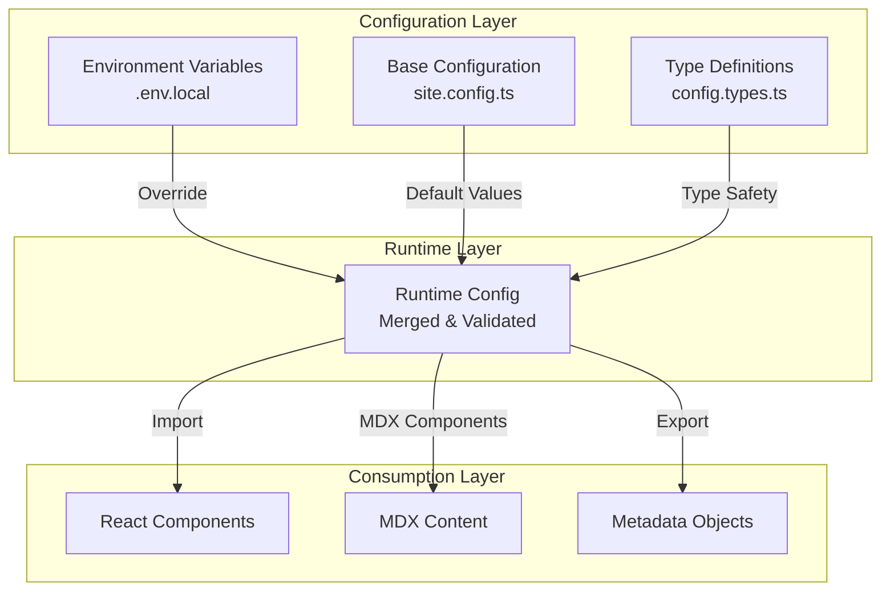

# Design Document: Centralized Site Configuration

## Overview

This design document outlines a centralized configuration system for managing site-wide variables, contact information, and placeholder values in a Next.js 14 application with TypeScript and MDX support. The system extends the existing `src/config/site.config.ts` structure to provide a comprehensive, type-safe configuration layer that eliminates hardcoded values throughout the codebase.

The design leverages TypeScript's type system for compile-time validation, Next.js environment variable conventions for environment-specific overrides, and MDX component injection for dynamic content rendering. The solution maintains backward compatibility with existing code while providing a clear migration path.

**Key Design Principles:**
- Single source of truth for all site-wide configuration
- Type safety through TypeScript interfaces and strict typing
- Environment-specific configuration via standard Next.js patterns
- Seamless integration with React components and MDX content
- Backward compatibility with existing configuration references

## Architecture

### High-Level Architecture



### Configuration Resolution Flow

1. **Build Time**: Base configuration is defined in `src/config/site.config.ts`
2. **Environment Override**: Environment variables (prefixed with `NEXT_PUBLIC_SITE_`) override base values
3. **Type Validation**: TypeScript validates all configuration at compile time
4. **Runtime Access**: Components and MDX content access the merged configuration
5. **Rendering**: Configuration values are injected into rendered output

### Directory Structure

```
src/
├── config/
│   ├── site.config.ts          # Main configuration file (extended)
│   ├── config.types.ts         # TypeScript type definitions
│   ├── constants.ts            # Existing UI constants (unchanged)
│   └── mdx-components.tsx      # MDX component overrides with config injection
├── app/
│   ├── privacy/page.tsx        # Updated to use config
│   ├── terms/page.tsx          # Updated to use config
│   └── ...
└── content/
    └── blog/
        └── *.mdx               # Updated to use config variables
```

## Components and Interfaces

### 1. Configuration Type Definitions

**File**: `src/config/config.types.ts`

This module defines the TypeScript interfaces for the entire configuration structure.

```typescript
/**
 * Contact information for various purposes
 */
export interface ContactConfig {
  /** General contact email for inquiries */
  general: string;
  /** Legal inquiries and terms-related contact */
  legal: string;
  /** Privacy policy and data protection inquiries */
  privacy: string;
  /** Technical support contact */
  support: string;
}

/**
 * Domain and URL configuration
 */
export interface DomainConfig {
  /** Primary site domain (e.g., "daltonousley.com") */
  domain: string;
  /** Full base URL including protocol (e.g., "https://daltonousley.com") */
  baseUrl: string;
  /** Display name for the domain in legal documents */
  displayName: string;
}

/**
 * Company and legal entity information
 */
export interface CompanyConfig {
  /** Legal entity name */
  legalName: string;
  /** Doing business as (DBA) name */
  dbaName: string;
  /** Business address for legal documents */
  address: {
    street?: string;
    city: string;
    state: string;
    country: string;
    postalCode?: string;
  };
  /** Jurisdiction for legal matters */
  jurisdiction: {
    state: string;
    country: string;
  };
}

/**
 * Social media links and handles
 */
export interface SocialConfig {
  github: string;
  linkedin: string;
  twitter?: string;
  [key: string]: string | undefined;
}

/**
 * Professional information
 */
export interface ProfessionalConfig {
  role: string;
  location: string;
  company: string;
}

/**
 * Meta information for SEO and branding
 */
export interface MetaConfig {
  keywords: string[];
  themeColor: string;
}

/**
 * Navigation paths
 */
export interface NavigationConfig {
  home: string;
  about: string;
  blog: string;
  projects: string;
  experience: string;
  [key: string]: string;
}

/**
 * Complete site configuration structure
 */
export interface SiteConfig {
  name: string;
  title: string;
  description: string;
  url: string;
  contact: ContactConfig;
  domain: DomainConfig;
  company: CompanyConfig;
  social: SocialConfig;
  professional: ProfessionalConfig;
  meta: MetaConfig;
  nav: NavigationConfig;
}
```

### 2. Base Configuration

**File**: `src/config/site.config.ts`

This module provides the base configuration with default values and environment variable overrides.

```typescript
import { SiteConfig } from './config.types';

/**
 * Helper function to get environment variable with fallback
 */
function getEnvVar(key: string, fallback: string): string {
  return process.env[key] || fallback;
}

/**
 * Centralized site configuration
 * 
 * Environment variable overrides:
 * - NEXT_PUBLIC_SITE_DOMAIN: Override domain.domain
 * - NEXT_PUBLIC_SITE_BASE_URL: Override domain.baseUrl
 * - NEXT_PUBLIC_CONTACT_EMAIL: Override contact.general
 * - NEXT_PUBLIC_LEGAL_EMAIL: Override contact.legal
 * - NEXT_PUBLIC_PRIVACY_EMAIL: Override contact.privacy
 * - NEXT_PUBLIC_SUPPORT_EMAIL: Override contact.support
 */
export const siteConfig: SiteConfig = {
  name: 'Dalton Ousley',
  title: 'Dalton Ousley - DevOps Engineer & Cloud Architect',
  description: 'DevOps Engineer and Cloud Architect specializing in Kubernetes, cloud infrastructure, and automation.',
  url: getEnvVar('NEXT_PUBLIC_SITE_BASE_URL', 'https://daltonousley.com/'),
  
  // Contact information
  contact: {
    general: getEnvVar('NEXT_PUBLIC_CONTACT_EMAIL', 'contact@daltonousley.com'),
    legal: getEnvVar('NEXT_PUBLIC_LEGAL_EMAIL', 'legal@daltonousley.com'),
    privacy: getEnvVar('NEXT_PUBLIC_PRIVACY_EMAIL', 'privacy@daltonousley.com'),
    support: getEnvVar('NEXT_PUBLIC_SUPPORT_EMAIL', 'support@daltonousley.com'),
  },

  // Domain configuration
  domain: {
    domain: getEnvVar('NEXT_PUBLIC_SITE_DOMAIN', 'daltonousley.com'),
    baseUrl: getEnvVar('NEXT_PUBLIC_SITE_BASE_URL', 'https://daltonousley.com'),
    displayName: 'daltonousley.com',
  },

  // Company information
  company: {
    legalName: 'Dalton Ousley',
    dbaName: 'Dalton Ousley',
    address: {
      city: 'Fort Collins',
      state: 'Colorado',
      country: 'United States',
    },
    jurisdiction: {
      state: 'Texas',
      country: 'United States',
    },
  },
  
  // Social links
  social: {
    github: 'https://github.com/DaltonBuilds',
    linkedin: 'https://linkedin.com/in/dalton-ousley',
    twitter: 'https://twitter.com/dalton-ousley',
  },

  // Professional details
  professional: {
    role: 'DevOps Engineer',
    location: 'Fort Collins, Colorado',
    company: 'Freelance DevOps Consultant',
  },

  // Meta information
  meta: {
    keywords: [
      'DevOps',
      'Cloud Architecture',
      'Kubernetes',
      'Infrastructure as Code',
      'Automation',
      'CI/CD',
      'Cloud Native',
    ],
    themeColor: '#10b981',
  },

  // Navigation
  nav: {
    home: '/',
    about: '/about',
    blog: '/blog',
    projects: '/projects',
    experience: '/experience',
  },
};

// Export individual sections for convenience
export const { contact, domain, company, social, professional, meta, nav } = siteConfig;

// Backward compatibility: maintain existing export structure
export default siteConfig;
```

### 3. MDX Component Integration

**File**: `src/config/mdx-components.tsx`

This module provides custom MDX components that inject configuration values into MDX content.

```typescript
import type { MDXComponents } from 'mdx/types';
import { siteConfig } from './site.config';

/**
 * Configuration value component for MDX
 * Usage in MDX: <ConfigValue path="contact.general" />
 */
function ConfigValue({ path }: { path: string }) {
  const value = path.split('.').reduce((obj: any, key) => obj?.[key], siteConfig);
  
  if (value === undefined) {
    console.error(`Configuration path "${path}" not found`);
    return <span className="text-red-500">[Config Error: {path}]</span>;
  }
  
  return <span>{String(value)}</span>;
}

/**
 * Email link component for MDX
 * Usage in MDX: <EmailLink type="contact" />
 */
function EmailLink({ type, children }: { type: keyof typeof siteConfig.contact; children?: React.ReactNode }) {
  const email = siteConfig.contact[type];
  
  if (!email) {
    console.error(`Email type "${type}" not found in configuration`);
    return <span className="text-red-500">[Email Error: {type}]</span>;
  }
  
  return (
    <a href={`mailto:${email}`} className="text-blue-400 hover:underline">
      {children || email}
    </a>
  );
}

/**
 * Domain link component for MDX
 * Usage in MDX: <DomainLink />
 */
function DomainLink({ children }: { children?: React.ReactNode }) {
  return (
    <a href={siteConfig.domain.baseUrl} className="text-blue-400 hover:underline">
      {children || siteConfig.domain.displayName}
    </a>
  );
}

/**
 * Custom MDX components with configuration injection
 */
export function useMDXComponents(components: MDXComponents): MDXComponents {
  return {
    ...components,
    ConfigValue,
    EmailLink,
    DomainLink,
  };
}
```

### 4. React Component Integration

React components can directly import and use the configuration:

```typescript
import { siteConfig, contact, domain } from '@/config/site.config';

// Use in component
export default function ContactPage() {
  return (
    <div>
      <p>Email us at: {contact.general}</p>
      <p>Visit: {domain.displayName}</p>
    </div>
  );
}
```

### 5. Metadata Integration

Next.js metadata objects can use configuration values:

```typescript
import { siteConfig } from '@/config/site.config';
import { Metadata } from 'next';

export const metadata: Metadata = {
  title: `Privacy Policy - ${siteConfig.name}`,
  description: `Privacy Policy for ${siteConfig.domain.displayName}`,
};
```

## Data Models

### Configuration Data Model

The configuration system uses a hierarchical data model with the following structure:

```
SiteConfig
├── name: string
├── title: string
├── description: string
├── url: string
├── contact: ContactConfig
│   ├── general: string
│   ├── legal: string
│   ├── privacy: string
│   └── support: string
├── domain: DomainConfig
│   ├── domain: string
│   ├── baseUrl: string
│   └── displayName: string
├── company: CompanyConfig
│   ├── legalName: string
│   ├── dbaName: string
│   ├── address: AddressConfig
│   │   ├── street?: string
│   │   ├── city: string
│   │   ├── state: string
│   │   ├── country: string
│   │   └── postalCode?: string
│   └── jurisdiction: JurisdictionConfig
│       ├── state: string
│       └── country: string
├── social: SocialConfig
│   ├── github: string
│   ├── linkedin: string
│   └── twitter?: string
├── professional: ProfessionalConfig
│   ├── role: string
│   ├── location: string
│   └── company: string
├── meta: MetaConfig
│   ├── keywords: string[]
│   └── themeColor: string
└── nav: NavigationConfig
    ├── home: string
    ├── about: string
    ├── blog: string
    ├── projects: string
    └── experience: string
```

### Environment Variable Mapping

| Environment Variable | Configuration Path | Default Value |
|---------------------|-------------------|---------------|
| `NEXT_PUBLIC_SITE_DOMAIN` | `domain.domain` | `daltonousley.com` |
| `NEXT_PUBLIC_SITE_BASE_URL` | `domain.baseUrl` | `https://daltonousley.com` |
| `NEXT_PUBLIC_CONTACT_EMAIL` | `contact.general` | `contact@daltonousley.com` |
| `NEXT_PUBLIC_LEGAL_EMAIL` | `contact.legal` | `legal@daltonousley.com` |
| `NEXT_PUBLIC_PRIVACY_EMAIL` | `contact.privacy` | `privacy@daltonousley.com` |
| `NEXT_PUBLIC_SUPPORT_EMAIL` | `contact.support` | `support@daltonousley.com` |

**Note**: All environment variables use the `NEXT_PUBLIC_` prefix to make them available in both server and client contexts, as required by Next.js for values used in browser-rendered components.


## Correctness Properties

*A property is a characteristic or behavior that should hold true across all valid executions of a system—essentially, a formal statement about what the system should do. Properties serve as the bridge between human-readable specifications and machine-verifiable correctness guarantees.*

### Property 1: Configuration Structure Completeness

*For any* instance of the Site_Config object, all required configuration sections (contact, domain, company, social, professional, meta, nav) SHALL be defined with valid, non-empty values for required fields.

**Validates: Requirements 1.1, 1.2, 1.3, 1.4**

**Rationale**: This property ensures that the configuration object always has a complete structure with all necessary fields populated. This prevents runtime errors from missing configuration values and ensures that any code depending on the configuration can safely access required fields.

### Property 2: MDX Configuration Value Injection

*For any* valid configuration path (e.g., "contact.general", "domain.displayName"), when referenced in an MDX component, the system SHALL correctly resolve and render the corresponding configuration value.

**Validates: Requirements 4.1, 4.2, 4.3**

**Rationale**: This property ensures that the MDX component system can dynamically inject configuration values into content. This is critical for maintaining consistency across blog posts and content pages without hardcoding values.

### Property 3: MDX Error Handling for Invalid Paths

*For any* invalid or non-existent configuration path referenced in an MDX component, the system SHALL render a visible error message indicating the invalid path rather than silently failing or throwing an exception.

**Validates: Requirements 4.4**

**Rationale**: This property ensures graceful degradation when content authors make mistakes in configuration path references. Clear error messages help identify and fix issues quickly during development.

### Property 4: Environment Variable Override Precedence

*For any* configuration value that supports environment variable override, when the corresponding environment variable is set, the runtime configuration SHALL use the environment variable value instead of the default value.

**Validates: Requirements 5.1, 5.2**

**Rationale**: This property ensures that environment-specific configuration works correctly across different deployment environments (development, staging, production). This is essential for maintaining different contact emails or domains per environment.

## Error Handling

### Configuration Validation Errors

**Error Type**: Missing Required Configuration
- **Trigger**: Required configuration field is undefined or empty
- **Handling**: TypeScript compilation error (compile-time) or console error (runtime)
- **User Impact**: Developer sees clear error message indicating which field is missing
- **Recovery**: Developer must provide the missing configuration value

**Error Type**: Invalid Configuration Type
- **Trigger**: Configuration value has wrong type (e.g., string instead of object)
- **Handling**: TypeScript compilation error
- **User Impact**: Developer sees type error during development
- **Recovery**: Developer must correct the type mismatch

### MDX Component Errors

**Error Type**: Invalid Configuration Path
- **Trigger**: MDX component references non-existent configuration path
- **Handling**: Render error message in place of value, log error to console
- **User Impact**: Visible error message in rendered content during development
- **Recovery**: Content author corrects the configuration path reference

**Error Type**: MDX Component Rendering Failure
- **Trigger**: Unexpected error during MDX component rendering
- **Handling**: Catch error, render fallback error message, log to console
- **User Impact**: Graceful degradation with error message
- **Recovery**: Developer investigates console logs and fixes underlying issue

### Environment Variable Errors

**Error Type**: Invalid Environment Variable Format
- **Trigger**: Environment variable value doesn't match expected format (e.g., invalid email)
- **Handling**: Log warning to console, fall back to default value
- **User Impact**: Configuration uses default value instead of invalid override
- **Recovery**: Developer corrects environment variable format

**Error Type**: Missing Environment Variable
- **Trigger**: Expected environment variable is not set
- **Handling**: Use default configuration value (no error)
- **User Impact**: None - system uses sensible defaults
- **Recovery**: Not applicable - this is expected behavior

### Error Logging Strategy

All configuration-related errors will be logged to the console with the following format:

```
[Config Error] <Error Type>: <Detailed Message>
Context: <Relevant Context Information>
```

Example:
```
[Config Error] Invalid Path: Configuration path "contact.invalid" not found
Context: MDX component in file "blog/hello-world.mdx"
```

## Testing Strategy

The centralized site configuration system will be validated through a dual testing approach combining unit tests for specific scenarios and property-based tests for universal correctness guarantees.

### Unit Testing Approach

Unit tests will focus on:

1. **Configuration Structure Validation**
   - Test that all required configuration sections exist
   - Test that email addresses are valid format
   - Test that URLs are valid format
   - Test specific configuration values match expected defaults

2. **MDX Component Integration**
   - Test ConfigValue component renders correct value for valid path
   - Test ConfigValue component renders error for invalid path
   - Test EmailLink component generates correct mailto link
   - Test DomainLink component renders correct domain

3. **Environment Variable Overrides**
   - Test that setting NEXT_PUBLIC_CONTACT_EMAIL overrides contact.general
   - Test that setting NEXT_PUBLIC_SITE_DOMAIN overrides domain.domain
   - Test that missing environment variables fall back to defaults

4. **Backward Compatibility**
   - Test that existing siteConfig export still works
   - Test that destructured exports (contact, domain, etc.) work
   - Test that existing code can import without modifications

5. **React Component Integration**
   - Test that configuration can be imported in React components
   - Test that configuration values render correctly in JSX
   - Test that configuration works in Next.js metadata objects

6. **Migration Validation**
   - Test that Privacy Policy page uses config values (not hardcoded)
   - Test that Terms of Use page uses config values (not hardcoded)
   - Test that blog MDX content uses config values (not hardcoded)

### Property-Based Testing Approach

Property-based tests will validate universal properties across randomized inputs. Each test will run a minimum of 100 iterations.

**Property Test 1: Configuration Structure Completeness**
- **Tag**: Feature: centralized-site-configuration, Property 1: Configuration structure completeness
- **Generator**: Generate various configuration objects with different values
- **Property**: All required fields must be present and non-empty
- **Validates**: Requirements 1.1, 1.2, 1.3, 1.4

**Property Test 2: MDX Configuration Value Injection**
- **Tag**: Feature: centralized-site-configuration, Property 2: MDX configuration value injection
- **Generator**: Generate random valid configuration paths
- **Property**: For any valid path, ConfigValue component resolves to correct value
- **Validates**: Requirements 4.1, 4.2, 4.3

**Property Test 3: MDX Error Handling for Invalid Paths**
- **Tag**: Feature: centralized-site-configuration, Property 3: MDX error handling for invalid paths
- **Generator**: Generate random invalid configuration paths
- **Property**: For any invalid path, ConfigValue component renders error message
- **Validates**: Requirements 4.4

**Property Test 4: Environment Variable Override Precedence**
- **Tag**: Feature: centralized-site-configuration, Property 4: Environment variable override precedence
- **Generator**: Generate random environment variable values
- **Property**: For any overridable config value, env var takes precedence
- **Validates**: Requirements 5.1, 5.2

### Testing Tools

- **Unit Testing**: Jest with React Testing Library
- **Property-Based Testing**: fast-check (JavaScript/TypeScript property-based testing library)
- **Type Testing**: TypeScript compiler (tsc) for compile-time validation
- **Integration Testing**: Playwright or Cypress for end-to-end validation

### Test Coverage Goals

- **Unit Test Coverage**: Minimum 90% code coverage for configuration modules
- **Property Test Coverage**: All correctness properties must have corresponding property tests
- **Integration Test Coverage**: All migration scenarios (legal pages, blog content) must be validated
- **Type Coverage**: 100% TypeScript strict mode compliance

### Continuous Integration

All tests will run automatically on:
- Every pull request
- Every commit to main branch
- Nightly builds for comprehensive property test runs (1000+ iterations)

Test failures will block deployment to production.
