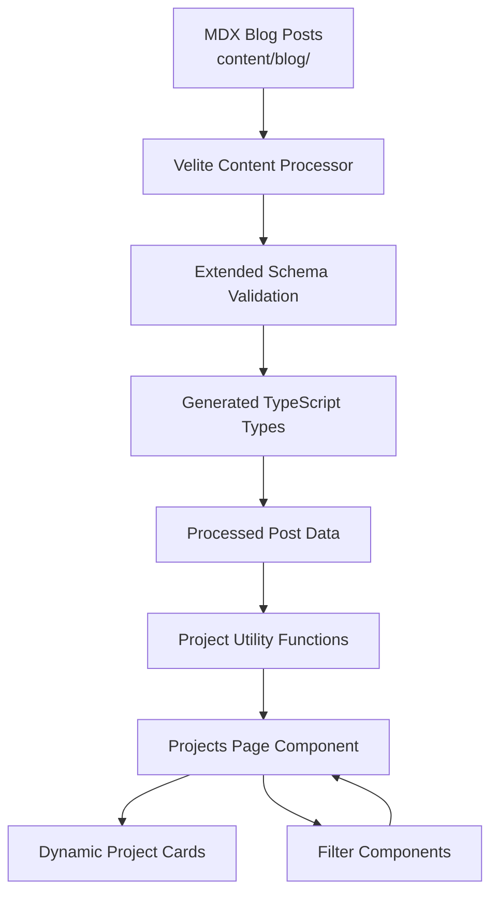

# Design Document: Dynamic Project Showcase System

## Overview

The Dynamic Project Showcase System transforms the portfolio's `/projects` page from a static, hardcoded display into a dynamic content-driven system powered by the existing Velite content pipeline. The system extends the current blog post schema with optional project-specific metadata fields, enabling rich project categorization, status tracking, and technology filtering while maintaining the single source of truth principle—all projects are blog posts, but not all blog posts are projects.

The design leverages Next.js 14+ App Router patterns, TypeScript for type safety, and Velite's schema validation to ensure data integrity. The system is architected for extensibility, supporting future features like search, pagination, project series, and related project recommendations without requiring major refactoring.

## Architecture

### High-Level Architecture



### Component Hierarchy

```
/projects (Projects Page)
├── ProjectsHeader (Title, description)
├── ProjectFilters (Status, Tech Stack, Category filters)
├── ProjectGrid (Layout container)
│   └── ProjectCard[] (Individual project cards)
│       ├── ProjectImage
│       ├── ProjectHeader (Title, Status badge)
│       ├── ProjectDescription
│       ├── ProjectMeta (Category, Date)
│       ├── TechStackTags
│       └── ProjectLinks (View Project, View Code, Read More)
└── EmptyState (No projects found)
```

### Data Flow

1. **Build Time**: Velite processes MDX files → validates against extended schema → generates typed data
2. **Page Load**: Projects page imports processed data → filters for project posts → applies user filters
3. **Rendering**: Filtered data maps to ProjectCard components → displays in responsive grid
4. **Interaction**: User applies filters → client-side filtering updates displayed cards

## Components and Interfaces

### Extended Velite Schema

```typescript
// velite.config.ts (extended)
const posts = defineCollection({
  name: 'Post',
  pattern: 'blog/**/*.mdx',
  schema: s.object({
    // Existing fields
    title: s.string().max(99),
    slug: s.slug('posts'),
    description: s.string().max(999).optional(),
    date: s.isodate(),
    lastModified: s.isodate().optional(),
    published: s.boolean().default(true),
    featured: s.boolean().default(false),
    author: s.string().default('dalton-ousley'),
    categories: s.array(s.string()).default([]),
    tags: s.array(s.string()).default([]),
    series: s.string().optional(),
    seriesOrder: s.number().optional(),
    image: s.object({ src: s.string(), alt: s.string() }).optional(),
    seo: s.object({
      keywords: s.array(s.string()).default([]),
      ogImage: s.string().optional(),
    }).default({}),
    body: s.mdx(),
    
    // New project-specific fields
    projectCategory: s.string().optional(),
    projectStatus: s.enum(['Completed', 'In Progress', 'Not Started']).optional(),
    techStack: s.array(s.string()).default([]),
    projectUrl: s.string().url().optional(),
    githubUrl: s.string().url().optional(),
  })
  .transform((data) => ({
    ...data,
    readingTime: Math.ceil(readingTime(data.body).minutes),
    permalink: `/blog/${data.slug}`,
  })),
})
```

### TypeScript Interfaces

```typescript
// types/project.ts
export type ProjectStatus = 'Completed' | 'In Progress' | 'Not Started'

export interface ProjectPost {
  // Core blog fields
  title: string
  slug: string
  description?: string
  date: string
  lastModified?: string
  published: boolean
  featured: boolean
  author: string
  categories: string[]
  tags: string[]
  series?: string
  seriesOrder?: number
  image?: { src: string; alt: string }
  seo: {
    keywords: string[]
    ogImage?: string
  }
  body: string
  readingTime: number
  permalink: string
  
  // Project-specific fields
  projectCategory?: string
  projectStatus?: ProjectStatus
  techStack: string[]
  projectUrl?: string
  githubUrl?: string
}

export interface ProjectFilters {
  status?: ProjectStatus
  technologies: string[]
  category?: string
}

export interface GroupedProjects {
  [category: string]: ProjectPost[]
}
```

### Utility Functions

```typescript
// lib/projects.ts

/**
 * Filters all posts to return only project posts
 * A project post has "projects" in its categories array
 */
export function getProjectPosts(posts: Post[]): ProjectPost[] {
  return posts
    .filter(post => post.published && post.categories.includes('projects'))
    .sort((a, b) => new Date(b.date).getTime() - new Date(a.date).getTime())
}

/**
 * Groups project posts by their projectCategory
 * Posts without a category go into "Uncategorized"
 */
export function groupProjectsByCategory(projects: ProjectPost[]): GroupedProjects {
  return projects.reduce((acc, project) => {
    const category = project.projectCategory || 'Uncategorized'
    if (!acc[category]) {
      acc[category] = []
    }
    acc[category].push(project)
    return acc
  }, {} as GroupedProjects)
}

/**
 * Extracts unique technologies from all project posts
 */
export function getAllTechnologies(projects: ProjectPost[]): string[] {
  const techSet = new Set<string>()
  projects.forEach(project => {
    project.tags.forEach(tag => techSet.add(tag))
    project.techStack.forEach(tech => techSet.add(tech))
  })
  return Array.from(techSet).sort()
}

/**
 * Filters projects based on user-selected filters
 */
export function filterProjects(
  projects: ProjectPost[],
  filters: ProjectFilters
): ProjectPost[] {
  return projects.filter(project => {
    // Status filter
    if (filters.status && project.projectStatus !== filters.status) {
      return false
    }
    
    // Technology filter (match any selected tech)
    if (filters.technologies.length > 0) {
      const projectTechs = [...project.tags, ...project.techStack]
      const hasMatchingTech = filters.technologies.some(tech =>
        projectTechs.includes(tech)
      )
      if (!hasMatchingTech) return false
    }
    
    // Category filter
    if (filters.category && project.projectCategory !== filters.category) {
      return false
    }
    
    return true
  })
}

/**
 * Gets count of projects by status
 */
export function getProjectCountsByStatus(projects: ProjectPost[]): Record<ProjectStatus, number> {
  return projects.reduce((acc, project) => {
    const status = project.projectStatus || 'Not Started'
    acc[status] = (acc[status] || 0) + 1
    return acc
  }, {} as Record<ProjectStatus, number>)
}
```

### Component Interfaces

```typescript
// components/projects/ProjectCard.tsx
interface ProjectCardProps {
  project: ProjectPost
}

// components/projects/ProjectFilters.tsx
interface ProjectFiltersProps {
  projects: ProjectPost[]
  filters: ProjectFilters
  onFilterChange: (filters: ProjectFilters) => void
}

// components/projects/ProjectGrid.tsx
interface ProjectGridProps {
  projects: ProjectPost[]
  groupByCategory?: boolean
}

// components/projects/TechStackTags.tsx
interface TechStackTagsProps {
  technologies: string[]
  maxDisplay?: number
}

// components/projects/StatusBadge.tsx
interface StatusBadgeProps {
  status: ProjectStatus
}
```

## Data Models

### Project Post Frontmatter Example

```yaml
---
title: "TaskFlow: Building a Task Manager App on Cloudflare"
slug: "taskflow-cloudflare-task-manager"
description: "Building a full-stack task management application using Cloudflare Workers, D1, and React"
date: "2024-01-15"
published: true
featured: true
author: "dalton-ousley"
categories: ["projects"]
tags: ["cloudflare", "workers", "d1", "react", "typescript"]
image:
  src: "/images/projects/taskflow.png"
  alt: "TaskFlow application screenshot"
projectCategory: "Full-Stack"
projectStatus: "Completed"
techStack: ["Cloudflare Workers", "D1 Database", "React", "TypeScript", "Tailwind CSS"]
projectUrl: "https://taskflow.example.com"
githubUrl: "https://github.com/username/taskflow"
---
```

### Project Categories

Recommended project categories (extensible):
- **Cloud Engineering**: AWS, Azure, GCP infrastructure projects
- **DevOps**: CI/CD, automation, infrastructure as code
- **Full-Stack**: Complete web applications
- **Homelab**: Self-hosted services and infrastructure
- **Automation**: Scripts, tools, workflow automation
- **Open Source**: Contributions and maintained projects

### Status Badge Styling

```typescript
const statusStyles: Record<ProjectStatus, { bg: string; text: string; border: string }> = {
  'Completed': {
    bg: 'bg-green-100 dark:bg-green-900/30',
    text: 'text-green-800 dark:text-green-300',
    border: 'border-green-300 dark:border-green-700'
  },
  'In Progress': {
    bg: 'bg-blue-100 dark:bg-blue-900/30',
    text: 'text-blue-800 dark:text-blue-300',
    border: 'border-blue-300 dark:border-blue-700'
  },
  'Not Started': {
    bg: 'bg-gray-100 dark:bg-gray-800',
    text: 'text-gray-800 dark:text-gray-300',
    border: 'border-gray-300 dark:border-gray-600'
  }
}
```


## Correctness Properties

A property is a characteristic or behavior that should hold true across all valid executions of a system—essentially, a formal statement about what the system should do. Properties serve as the bridge between human-readable specifications and machine-verifiable correctness guarantees.

### Property Reflection

After analyzing all acceptance criteria, I identified several areas where properties can be consolidated:

- **Schema validation properties (1.1-1.8)** can be combined into comprehensive schema validation properties
- **URL validation properties (1.5, 1.6)** are redundant and can be combined into one property
- **Conditional rendering properties (3.3, 3.4, 3.5)** follow the same pattern and can be generalized
- **Filter properties (5.2, 6.3)** share the same filtering logic and can be unified
- **Multiple technology filter properties (6.4, 6.5)** can be combined into one comprehensive property

### Schema Validation Properties

**Property 1: Schema validates project-specific fields correctly**

*For any* blog post with project-specific fields (projectCategory, projectStatus, techStack, projectUrl, githubUrl), when processed by the Velite schema, the schema should accept valid values and reject invalid values according to field constraints.

**Validates: Requirements 1.1, 1.2, 1.3, 1.4**

**Property 2: Schema accepts valid URLs for project links**

*For any* blog post with projectUrl or githubUrl fields, when the field contains a valid URL string, the schema should accept it, and when it contains an invalid URL string, the schema should reject it.

**Validates: Requirements 1.5, 1.6**

**Property 3: Optional project fields use defaults gracefully**

*For any* blog post that lacks project-specific fields, when processed by the Velite schema, the post should process successfully with default values or undefined for optional fields without throwing errors.

**Validates: Requirements 1.7**

**Property 4: Schema preserves existing blog functionality**

*For any* blog post with existing fields (title, slug, description, date, categories, tags, etc.), when processed by the extended schema, all existing fields and transformations (readingTime, permalink) should remain intact and unchanged.

**Validates: Requirements 1.8**

### Project Filtering Properties

**Property 5: Project post filtering by category**

*For any* collection of blog posts, when filtered for project posts, the result should contain only posts where the categories array includes "projects" and the published field is true, sorted by date in descending order.

**Validates: Requirements 2.1, 2.2, 2.4**

**Property 6: Incomplete project posts included with defaults**

*For any* blog post with categories containing "projects" but lacking project metadata fields, when queried as a project post, it should be included in results with default or undefined values for missing project fields.

**Validates: Requirements 2.3**

### Rendering Properties

**Property 7: Project cards render all required fields**

*For any* project post, when rendered as a project card, the rendered output should contain the project's title, description, status, category, tags, and links (where present).

**Validates: Requirements 3.2**

**Property 8: Conditional fields render when present**

*For any* project post, when the post has an image field, projectUrl field, or githubUrl field, the rendered project card should display the image, "View Project" link, or "View Code" link respectively.

**Validates: Requirements 3.3, 3.4, 3.5**

**Property 9: Status badges have correct styling**

*For any* project post with a projectStatus value, when rendered, the status badge should have CSS classes corresponding to that status ("Completed" → green, "In Progress" → blue, "Not Started" → gray).

**Validates: Requirements 3.6**

**Property 10: Tech stack tags render completely**

*For any* project post with tags, when rendered as a project card, all tags from the tags field should appear in the rendered output.

**Validates: Requirements 3.7**

**Property 11: Project card navigation**

*For any* project card, when clicked, the navigation should direct to the blog post permalink for that project.

**Validates: Requirements 3.8**

### Grouping and Organization Properties

**Property 12: Projects group by category correctly**

*For any* collection of project posts, when grouped by projectCategory, each project should appear in exactly one group corresponding to its projectCategory value, and projects without a projectCategory should appear in an "Uncategorized" group.

**Validates: Requirements 4.1, 4.3**

**Property 13: Category headings render for non-empty groups**

*For any* grouped collection of projects, when rendered, each category with at least one project should display a category heading, and categories with zero projects should not display.

**Validates: Requirements 4.2, 4.5**

**Property 14: Category ordering is deterministic**

*For any* collection of project posts, when grouped by category and rendered multiple times with the same input, the category order should be identical across all renderings.

**Validates: Requirements 4.4**

### Filtering Properties

**Property 15: Status and technology filters work correctly**

*For any* collection of project posts and any selected filter (status or technology), when the filter is applied, the result should contain only projects matching the filter criteria (matching status OR containing the selected technology tag).

**Validates: Requirements 5.2, 6.3**

**Property 16: Multiple technology filters use OR logic**

*For any* collection of project posts and any set of selected technology filters, when applied, the result should contain all projects that match at least one of the selected technologies.

**Validates: Requirements 6.4, 6.5**

**Property 17: Filter state persistence**

*For any* filter state (status, technologies, category), when set and page interactions occur (scrolling, hovering, etc.), the filter state should remain unchanged until explicitly modified by user action.

**Validates: Requirements 5.4**

**Property 18: Project counts by status are accurate**

*For any* collection of project posts, when counting projects by status, the sum of counts for all statuses should equal the total number of projects, and each count should match the actual number of projects with that status.

**Validates: Requirements 5.5**

**Property 19: Technology extraction produces unique values**

*For any* collection of project posts, when extracting technologies from tags and techStack fields, the result should contain each unique technology exactly once, with no duplicates.

**Validates: Requirements 6.1**

### Integration Properties

**Property 20: Project posts function as blog posts**

*For any* project post, when accessed via its blog permalink, it should render with full blog post functionality including MDX content, reading time, author, and all standard blog post features.

**Validates: Requirements 7.1, 7.2**

**Property 21: Project metadata appears on blog pages**

*For any* project post, when rendered on its blog post page, the page should display project-specific metadata (status, category, tech stack, project links) in addition to standard blog content.

**Validates: Requirements 7.3**

**Property 22: Project posts generate correct meta tags**

*For any* project post, when rendered, the page should include meta tags with appropriate values for title, description, keywords, and Open Graph image.

**Validates: Requirements 7.4**

**Property 23: Project posts appear in blog index**

*For any* blog index page, when rendered, project posts should appear alongside non-project posts in the post list.

**Validates: Requirements 7.5**

### Type Safety Properties

**Property 24: Type guard correctly identifies project posts**

*For any* blog post, when passed to the project post type guard function, it should return true if and only if the post's categories array contains "projects".

**Validates: Requirements 8.3**

### Extensibility Properties

**Property 25: Series fields work for project posts**

*For any* project post with series and seriesOrder fields, when processed and rendered, the series information should be preserved and accessible for grouping related projects.

**Validates: Requirements 9.1**

**Property 26: Query functions support pagination parameters**

*For any* project query function, when called with pagination parameters (page number, page size), it should return the correct subset of projects for that page.

**Validates: Requirements 9.2**

**Property 27: Utility functions perform correct operations**

*For any* collection of project posts, when passed to utility functions (filterProjects, groupProjectsByCategory, getAllTechnologies, getProjectCountsByStatus), each function should return results that satisfy its documented behavior.

**Validates: Requirements 9.3**

## Error Handling

### Schema Validation Errors

**Invalid Project Status**:
- Error: Velite build fails with clear message indicating invalid status value
- Recovery: User corrects frontmatter to use valid status enum value
- Prevention: TypeScript types and IDE autocomplete guide correct values

**Invalid URL Format**:
- Error: Velite build fails with clear message indicating invalid URL
- Recovery: User corrects URL format in frontmatter
- Prevention: Schema validation catches at build time before deployment

**Missing Required Fields**:
- Error: Velite build fails if required blog fields are missing
- Recovery: User adds missing required fields
- Prevention: Schema validation enforces required fields

### Runtime Errors

**No Projects Found**:
- Behavior: Display empty state component with helpful message
- Message: "No projects found. Check back soon!"
- Prevention: Always handle empty array case in rendering logic

**Missing Optional Fields**:
- Behavior: Gracefully omit optional UI elements (links, images)
- Example: If no projectUrl, don't render "View Project" button
- Prevention: Conditional rendering checks for field presence

**Filter Results in Empty Set**:
- Behavior: Display "No projects match your filters" message
- Action: Provide "Clear filters" button to reset
- Prevention: Show filter counts to indicate available options

**Image Load Failures**:
- Behavior: Display placeholder or fallback image
- Fallback: Generic project icon or gradient background
- Prevention: Validate image paths at build time when possible

### Data Consistency

**Category Mismatch**:
- Issue: Post has projectCategory but not "projects" in categories
- Handling: Post won't appear on projects page (categories is source of truth)
- Prevention: Documentation and examples emphasize categories requirement

**Duplicate Slugs**:
- Error: Velite build fails if duplicate slugs detected
- Recovery: User changes slug to be unique
- Prevention: Velite's slug validation enforces uniqueness

**Date Parsing Errors**:
- Error: Invalid date format causes build failure
- Recovery: User corrects date to ISO format
- Prevention: Schema validates isodate format

## Testing Strategy

### Dual Testing Approach

The system requires both unit tests and property-based tests for comprehensive coverage:

- **Unit tests**: Verify specific examples, edge cases, and error conditions
- **Property tests**: Verify universal properties across all inputs
- Both approaches are complementary and necessary

### Unit Testing Focus

Unit tests should focus on:
- Specific example projects with known expected outputs
- Edge cases (empty arrays, missing optional fields, boundary values)
- Error conditions (invalid data, missing required fields)
- Integration points (Velite schema processing, Next.js page rendering)
- Component rendering with specific props

Avoid writing too many unit tests—property-based tests handle covering lots of inputs. Keep unit tests focused on concrete examples that demonstrate correct behavior.

### Property-Based Testing Configuration

**Library Selection**: Use `fast-check` for TypeScript/JavaScript property-based testing

**Test Configuration**:
- Minimum 100 iterations per property test (due to randomization)
- Each property test must reference its design document property
- Tag format: `// Feature: dynamic-project-showcase, Property {number}: {property_text}`

**Property Test Implementation**:
- Each correctness property MUST be implemented by a SINGLE property-based test
- Generate random test data (posts, filters, categories) for comprehensive coverage
- Verify universal properties hold across all generated inputs

### Test Organization

```
tests/
├── unit/
│   ├── schema.test.ts          # Velite schema validation examples
│   ├── projects.test.ts        # Utility function examples
│   ├── components/
│   │   ├── ProjectCard.test.tsx
│   │   ├── ProjectFilters.test.tsx
│   │   └── ProjectGrid.test.tsx
│   └── pages/
│       └── projects.test.tsx
└── properties/
    ├── schema.properties.test.ts      # Properties 1-4
    ├── filtering.properties.test.ts   # Properties 5-6
    ├── rendering.properties.test.ts   # Properties 7-11
    ├── grouping.properties.test.ts    # Properties 12-14
    ├── filters.properties.test.ts     # Properties 15-19
    ├── integration.properties.test.ts # Properties 20-23
    ├── types.properties.test.ts       # Property 24
    └── extensibility.properties.test.ts # Properties 25-27
```

### Example Property Test

```typescript
// Feature: dynamic-project-showcase, Property 5: Project post filtering by category
import fc from 'fast-check'

describe('Project Filtering Properties', () => {
  it('filters posts by projects category and published status', () => {
    fc.assert(
      fc.property(
        fc.array(arbitraryBlogPost()),
        (posts) => {
          const projectPosts = getProjectPosts(posts)
          
          // All results must have "projects" in categories
          projectPosts.every(p => p.categories.includes('projects'))
          
          // All results must be published
          projectPosts.every(p => p.published === true)
          
          // Results should be sorted by date descending
          for (let i = 0; i < projectPosts.length - 1; i++) {
            const current = new Date(projectPosts[i].date)
            const next = new Date(projectPosts[i + 1].date)
            expect(current >= next).toBe(true)
          }
        }
      ),
      { numRuns: 100 }
    )
  })
})
```

### Test Data Generators

Create fast-check arbitraries for:
- Blog posts with random fields
- Project posts with random project metadata
- Valid and invalid URLs
- Valid and invalid status enums
- Random date ranges
- Random category and tag arrays

### Integration Testing

Test the complete flow:
1. Create test MDX files with project frontmatter
2. Run Velite processing
3. Verify generated data structure
4. Render projects page with test data
5. Verify correct rendering and filtering behavior

### Visual Regression Testing

Consider adding visual regression tests for:
- Project card layouts
- Status badge styling
- Filter UI components
- Empty states
- Responsive layouts

This ensures UI consistency as the system evolves.
