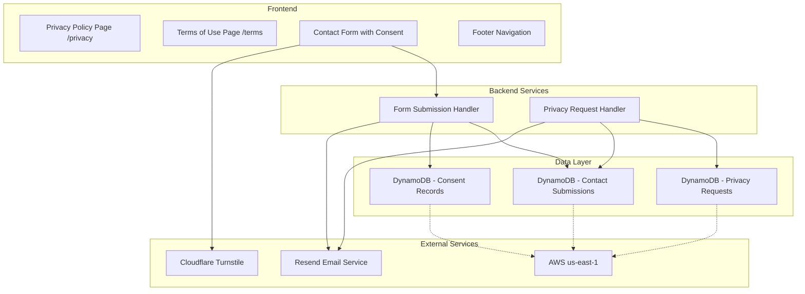

# Design Document: Legal Compliance Pages

## Overview

This design implements Privacy Policy and Terms of Use pages for daltonousley.com, ensuring compliance with GDPR, CCPA, and data protection best practices. The solution includes static policy pages, an enhanced contact form with consent mechanism, footer navigation, and a process for handling data subject rights requests.

The implementation focuses on transparency, user control, and legal compliance while maintaining a simple, maintainable architecture that fits within the existing portfolio website structure.

## Architecture

### High-Level Architecture



### Component Interaction Flow

1. **Policy Page Access**: User navigates to /privacy or /terms → Static page rendered with current policy content
2. **Form Submission with Consent**: User fills form → Checks consent box → Submits → Backend records consent timestamp → Stores submission in DynamoDB → Sends email notification
3. **Privacy Request**: User emails privacy request → Manual verification → Handler processes request → Response sent within 30 days

## Components and Interfaces

### 1. Privacy Policy Page Component

**Purpose**: Display comprehensive privacy policy with all required disclosures

**Interface**:
```typescript
interface PrivacyPolicyPage {
  lastUpdated: Date;
  sections: PolicySection[];
  contactEmail: string;
}

interface PolicySection {
  title: string;
  content: string;
  subsections?: PolicySection[];
}
```

**Key Sections**:
- Introduction and scope
- Data collection (what, why, legal basis)
- Data storage and retention (location, duration, TTL)
- Third-party services (Cloudflare, Resend, AWS)
- International data transfers (EU to USA)
- Data subject rights (GDPR and CCPA)
- Security measures
- Cookie policy
- Contact information
- Policy updates

### 2. Terms of Use Page Component

**Purpose**: Display terms of service and legal disclaimers

**Interface**:
```typescript
interface TermsOfUsePage {
  lastUpdated: Date;
  sections: PolicySection[];
  contactEmail: string;
}
```

**Key Sections**:
- Acceptance of terms
- Acceptable use policy
- Prohibited activities
- Intellectual property rights
- Liability limitations and disclaimers
- Governing law and jurisdiction
- Contact information
- Terms updates

### 3. Enhanced Contact Form Component

**Purpose**: Collect contact information with explicit consent mechanism

**Interface**:
```typescript
interface ContactFormData {
  name: string;
  email: string;
  company?: string;
  message: string;
  consentGiven: boolean;
  consentTimestamp: Date;
  turnstileToken: string;
}

interface ContactFormProps {
  onSubmit: (data: ContactFormData) => Promise<void>;
  privacyPolicyUrl: string;
  termsOfUseUrl: string;
}

interface ContactFormState {
  formData: Partial<ContactFormData>;
  consentChecked: boolean;
  isSubmitting: boolean;
  errors: FormErrors;
}
```

**Validation Rules**:
- Name: Required, 1-100 characters
- Email: Required, valid email format
- Company: Optional, max 100 characters
- Message: Required, 10-5000 characters
- Consent: Required (must be true)
- Turnstile token: Required, valid token

### 4. Footer Navigation Component

**Purpose**: Provide consistent access to policy pages across all site pages

**Interface**:
```typescript
interface FooterProps {
  links: FooterLink[];
}

interface FooterLink {
  label: string;
  url: string;
  category: 'legal' | 'social' | 'navigation';
}
```

**Legal Links**:
- Privacy Policy → /privacy
- Terms of Use → /terms

### 5. Form Submission Handler

**Purpose**: Process contact form submissions with consent recording

**Interface**:
```typescript
interface SubmissionHandler {
  processSubmission(data: ContactFormData): Promise<SubmissionResult>;
}

interface SubmissionResult {
  success: boolean;
  submissionId?: string;
  error?: string;
}

interface StoredSubmission {
  id: string;
  name: string;
  email: string;
  company?: string;
  message: string;
  consentGiven: boolean;
  consentTimestamp: Date;
  submittedAt: Date;
  ttl: number; // Unix timestamp for 18 months from submission
  ipAddress?: string; // For verification purposes
}
```

**Processing Steps**:
1. Validate Turnstile token
2. Validate form data
3. Generate unique submission ID
4. Calculate TTL (current timestamp + 18 months in seconds)
5. Store submission in DynamoDB with consent record
6. Send email notification via Resend
7. Return success/error response

### 6. Privacy Request Handler

**Purpose**: Process data subject rights requests (access, deletion, portability)

**Interface**:
```typescript
interface PrivacyRequestHandler {
  handleAccessRequest(email: string): Promise<AccessRequestResult>;
  handleDeletionRequest(email: string): Promise<DeletionRequestResult>;
  handlePortabilityRequest(email: string): Promise<PortabilityRequestResult>;
}

interface AccessRequestResult {
  success: boolean;
  data?: StoredSubmission[];
  error?: string;
}

interface DeletionRequestResult {
  success: boolean;
  deletedCount: number;
  error?: string;
}

interface PortabilityRequestResult {
  success: boolean;
  data?: string; // JSON formatted data
  error?: string;
}

interface PrivacyRequestLog {
  id: string;
  requestType: 'access' | 'deletion' | 'portability';
  requesterEmail: string;
  requestedAt: Date;
  processedAt?: Date;
  status: 'pending' | 'verified' | 'completed' | 'rejected';
  notes?: string;
}
```

**Request Processing Flow**:
1. Receive request via email
2. Create log entry with 'pending' status
3. Send verification email to requester
4. Upon verification, update status to 'verified'
5. Process request (query/delete/export data)
6. Send response to requester
7. Update log entry with 'completed' status and timestamp

## Data Models

### Contact Submission Table (DynamoDB)

**Table Name**: `contact-submissions`

**Primary Key**: `id` (String, UUID)

**Attributes**:
```typescript
{
  id: string;                    // UUID
  name: string;                  // Contact name
  email: string;                 // Contact email (GSI)
  company?: string;              // Optional company name
  message: string;               // Contact message
  consentGiven: boolean;         // Privacy policy consent
  consentTimestamp: number;      // Unix timestamp of consent
  submittedAt: number;           // Unix timestamp of submission
  ttl: number;                   // Unix timestamp for auto-deletion (18 months)
  ipAddress?: string;            // For verification (hashed)
}
```

**Global Secondary Index**: `email-index`
- Partition Key: `email`
- Purpose: Query submissions by email for privacy requests

**TTL Configuration**:
- TTL Attribute: `ttl`
- Automatic deletion after 18 months from submission

### Privacy Request Log Table (DynamoDB)

**Table Name**: `privacy-requests`

**Primary Key**: `id` (String, UUID)

**Attributes**:
```typescript
{
  id: string;                    // UUID
  requestType: string;           // 'access' | 'deletion' | 'portability'
  requesterEmail: string;        // Email of requester (GSI)
  requestedAt: number;           // Unix timestamp
  processedAt?: number;          // Unix timestamp when completed
  status: string;                // 'pending' | 'verified' | 'completed' | 'rejected'
  notes?: string;                // Additional notes
  verificationToken?: string;    // Token for email verification
  ttl: number;                   // Auto-delete after 2 years
}
```

**Global Secondary Index**: `email-status-index`
- Partition Key: `requesterEmail`
- Sort Key: `status`
- Purpose: Query requests by email and status

## GDPR Compliance Strategy

### International Data Transfers (EU to USA)

**Legal Basis**: The system relies on **explicit consent** as the legal mechanism for transferring EU personal data to the USA (AWS us-east-1).

**Implementation**:
1. **Transparent Disclosure**: Privacy Policy clearly states data is stored in USA
2. **Explicit Consent**: Contact form requires affirmative consent checkbox
3. **Right to Object**: Privacy Policy explains EU visitors can object to transfer (by not submitting form)
4. **Security Measures**: HTTPS encryption in transit, DynamoDB encryption at rest

**Alternative Considerations**:
- **Standard Contractual Clauses (SCCs)**: Not applicable for this use case (no ongoing business relationship)
- **Adequacy Decision**: USA does not have EU adequacy decision (post-Schrems II)
- **Legitimate Interest**: Could be argued for contact form, but consent is clearer and safer

**Recommendation**: For a portfolio contact form with minimal data collection and explicit consent, the current approach (consent-based transfer) is legally defensible. The key is:
1. Clear disclosure in Privacy Policy
2. Explicit, non-pre-checked consent checkbox
3. Easy-to-understand language about data location
4. Robust security measures

### Data Minimization

- Only collect necessary data (name, email, message, optional company)
- No tracking cookies or analytics
- 18-month retention with automatic deletion
- No data sharing with third parties except service providers (Resend for email)

### Data Subject Rights Implementation

**Access**: Query DynamoDB by email, return all submissions in human-readable format
**Deletion**: Delete all records matching email, confirm deletion
**Portability**: Export data as JSON
**Objection**: Explained in Privacy Policy (don't submit form)
**Rectification**: Manual process via email (update DynamoDB record)

## Error Handling

### Form Submission Errors

**Validation Errors**:
- Missing required fields → Display inline error messages
- Invalid email format → Display "Please enter a valid email address"
- Message too short/long → Display character count and limits
- Consent not given → Display "You must agree to the Privacy Policy and Terms of Use"

**Service Errors**:
- Turnstile verification fails → Display "Bot verification failed. Please try again."
- DynamoDB write fails → Display "Submission failed. Please try again later." + Log error
- Email send fails → Store submission but log error (non-blocking)
- Network timeout → Display "Request timed out. Please try again."

**Error Response Format**:
```typescript
interface ErrorResponse {
  success: false;
  error: {
    code: string;
    message: string;
    field?: string; // For validation errors
  };
}
```

### Privacy Request Errors

**Verification Errors**:
- Invalid email → Reject request, respond with "Email not found in our records"
- Verification timeout → Expire token after 24 hours, require new request
- Multiple failed verifications → Rate limit to prevent abuse

**Processing Errors**:
- DynamoDB query fails → Log error, retry up to 3 times, notify requester of delay
- No data found → Respond with "No data found for your email address"
- Partial deletion failure → Log error, retry, notify requester

## Testing Strategy

### Unit Tests

**Contact Form Component**:
- Test consent checkbox enables/disables submit button
- Test validation for each field
- Test error message display
- Test form reset after successful submission

**Form Submission Handler**:
- Test TTL calculation (18 months from submission)
- Test consent timestamp recording
- Test DynamoDB write with all fields
- Test error handling for service failures

**Privacy Request Handler**:
- Test email query returns correct records
- Test deletion removes all matching records
- Test portability exports correct JSON format
- Test verification token generation and validation

### Integration Tests

**End-to-End Form Submission**:
- Submit form with valid data → Verify stored in DynamoDB with correct TTL
- Submit form without consent → Verify rejection
- Submit form with invalid Turnstile → Verify rejection

**Privacy Request Flow**:
- Request access → Verify email sent → Verify data returned
- Request deletion → Verify email sent → Verify data deleted
- Request portability → Verify JSON export correct

### Manual Testing

**Legal Compliance Review**:
- Review Privacy Policy against GDPR checklist
- Review Privacy Policy against CCPA checklist
- Verify all disclosures are accurate and complete
- Test policy pages on mobile and desktop

**User Experience Testing**:
- Test form submission flow from user perspective
- Verify policy links are easily accessible
- Verify consent language is clear and understandable
- Test privacy request email flow


## Correctness Properties

A property is a characteristic or behavior that should hold true across all valid executions of a system—essentially, a formal statement about what the system should do. Properties serve as the bridge between human-readable specifications and machine-verifiable correctness guarantees.

### Property 1: Policy Pages Include Last Update Date

*For any* policy page (Privacy Policy or Terms of Use), when rendered, the output should include a visible "Last Updated" date field.

**Validates: Requirements 1.2, 2.2**

### Property 2: Consent Checkbox Controls Form Submission

*For any* contact form state where consent is not given (checkbox unchecked or false), attempting to submit the form should prevent submission and display an error message indicating consent is required.

**Validates: Requirements 3.4**

### Property 3: Consent Timestamp Recorded on Submission

*For any* valid contact form submission with consent given, the stored record in DynamoDB should include a consent timestamp that matches the submission time (within 1 second tolerance).

**Validates: Requirements 3.5**

### Property 4: Footer Links Present on All Pages

*For any* page on the website, the rendered HTML should include footer links to both /privacy and /terms.

**Validates: Requirements 4.2**

### Property 5: Footer Link Navigation

*For any* footer policy link (Privacy Policy or Terms of Use), clicking the link should navigate to the correct corresponding URL path.

**Validates: Requirements 4.3**

### Property 6: Access Request Returns All Data

*For any* email address with stored submissions, an access request should return all contact submissions associated with that email address, with no records missing.

**Validates: Requirements 5.2**

### Property 7: Deletion Request Removes All Data

*For any* email address with stored submissions, a deletion request should remove all contact submissions associated with that email address, and subsequent queries should return zero results.

**Validates: Requirements 5.3**

### Property 8: Portability Export Produces Valid JSON

*For any* email address with stored submissions, a portability request should produce a valid JSON string that can be parsed and contains all submission data fields (name, email, company, message, timestamps).

**Validates: Requirements 5.4**

### Property 9: Unverified Requests Are Rejected

*For any* privacy request (access, deletion, or portability) that has not completed email verification, the system should reject the request and not process it until verification is completed.

**Validates: Requirements 5.5**

### Property 10: Privacy Requests Are Logged

*For any* privacy request (access, deletion, or portability), a log entry should be created in the privacy-requests table with the request type, requester email, timestamp, and status.

**Validates: Requirements 5.6**

### Property 11: International Transfer Objection Prevents Submission

*For any* contact form submission where a user objects to international data transfer (indicated by not giving consent), the system should prevent the submission from being processed and stored.

**Validates: Requirements 6.5**

### Property 12: Cookie Banner Conditional Display

*For any* website configuration, if non-essential cookies are used (analytics, marketing), the system should display a cookie consent banner before setting those cookies; if only essential cookies are used, no banner should be displayed.

**Validates: Requirements 8.4, 8.5**

### Property 13: Policy Update Date Changes on Modification

*For any* policy document (Privacy Policy or Terms of Use), when the content is modified, the "Last Updated" date should be updated to reflect the modification date.

**Validates: Requirements 10.1**

### Property 14: Policy Version History Maintained

*For any* policy document modification, the system should maintain a record of the previous version with its effective date range, allowing version history to be reconstructed.

**Validates: Requirements 10.2**

### Property 15: TTL Calculation Accuracy

*For any* contact form submission, the TTL value stored in DynamoDB should equal the submission timestamp plus exactly 18 months (in seconds), ensuring automatic deletion occurs at the correct time.

**Validates: Requirements 1.6** (indirectly validates the 18-month retention requirement)

### Property 16: Form Validation Rejects Invalid Data

*For any* contact form submission with invalid data (missing required fields, invalid email format, message too short/long), the system should reject the submission and return specific validation error messages for each invalid field.

**Validates: Requirements 3.1, 3.4** (indirectly validates form data integrity)

