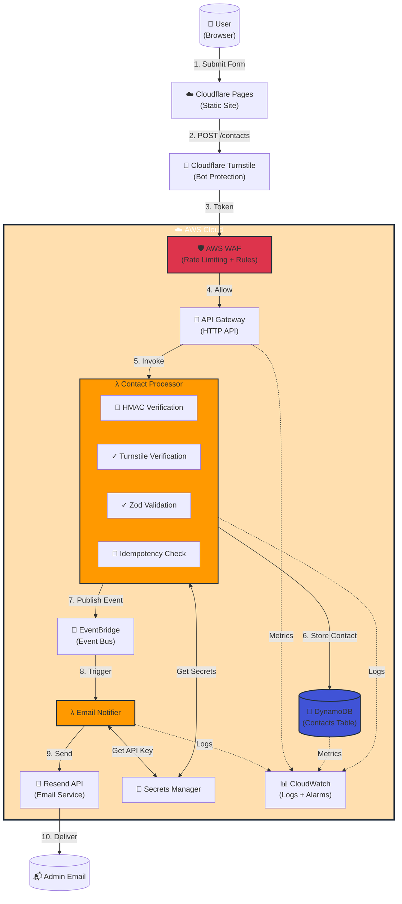
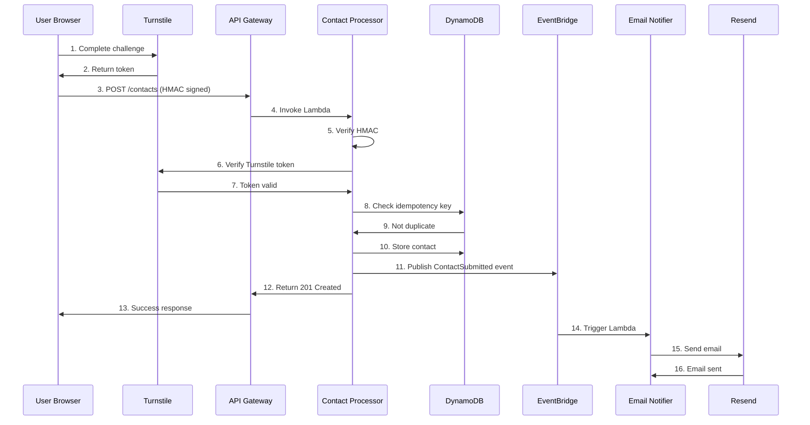

# React Form with AWS Backend

## Introduction — Why I Built My Own React Form with an AWS Backend

As part of my ongoing Cloud Engineering journey, I recently decided to replace a simple embedded contact form on my website with a **custom React form backed by AWS services**. While this may sound like a small project on the surface, it was an intentional step toward deepening my cloud skill set and creating something that would **persist and scale over time**.

For years, I’ve relied on software platforms like GoHighLevel (GHL) to handle form capture (among a zillion other things) for my freelance work. They’re convenient, but they’re also ephemeral — if I ever end my subscription, my form disappears along with it. That realization pushed me to build a solution I fully control. By developing my own **React form with an Amazon Web Services (AWS) backend**, I not only gained hands-on experience with services like DynamoDB, API Gateway, Lambda, and Secrets Manager, but I also laid the groundwork for a sustainable and secure form system that lives independently of any third-party SaaS.

More importantly, this was a deliberate **mini cloud project** designed to give me more “reps” working with AWS infrastructure in a practical way. Now that I’ve passed the [Google Professional Cloud Architect exam](https://daltonousley.com/blog/google-professional-cloud-architect-exam-prep), and deep into a different GCP project (that one is almost done too), I didn’t want to leave AWS out of my roadmap. This isn’t a theoretical lab exercise — it’s a real, production feature integrated directly into my portfolio website. And since I’m currently building out multiple cloud projects to strengthen my Cloud Engineering and DevOps skills, this kind of focused, end-to-end build was exactly what I needed.

## Architecture Overview

While the frontend is built using a simple React form, the real power of this project lives in the **AWS backend**. Rather than submitting form data to a third-party service, the React form communicates with a custom, event-driven backend built entirely on AWS. This architecture not only reinforces modern Cloud Engineering best practices but also gives me **full control over validation, security, storage, and monitoring** to name a few.

At a high level, the flow involves **seven AWS services** working together in a secure and modular fashion:

- 🛡️ **AWS WAF** – Filters traffic, applies rate limiting, and blocks malicious patterns
- 🚪 **API Gateway** – Serves as the entry point for form submissions
- 🧠 **AWS Lambda** – Processes incoming requests (contact processor) and handles asynchronous notifications (email notifier via [Resend](https://resend.com/))
- 💾 **DynamoDB** – Stores validated contact data with TTL-based retention
- 📡 **EventBridge** – Publishes `ContactSubmitted` events to decouple processing steps
- 🔑 **Secrets Manager** – Stores Cloudflare Turnstile secrets and Resend API keys
- 📊 **CloudWatch** – Aggregates logs, metrics, and alarms for observability

Below is the **high-level architecture diagram** showing the full flow from the browser to AWS and back:

---

### Request Flow

When a user submits the form, the following steps take place:

1. [**React Hook Form**](https://react-hook-form.com/) validates inputs on the client side using Zod.
2. **Cloudflare Turnstile** challenges the user to confirm they’re human, issuing a token on success.
3. The browser **signs the request with an HMAC** using a timestamp and payload hash to prevent tampering.
4. **AWS WAF** evaluates the request against rate limiting rules and known attack patterns.
5. **API Gateway** receives the request, applies throttling, and invokes the Contact Processor Lambda.
6. **Contact Processor Lambda**:
    - Verifies HMAC signature
    - Validates the Turnstile token with Cloudflare’s API
    - Validates the payload schema with [Zod](https://zod.dev/)
    - Checks for duplicates using an idempotency key in DynamoDB
    - Stores contacts with an 18-month TTL
    - Publishes a `ContactSubmitted` event to EventBridge
7. **EventBridge** asynchronously triggers the Email Notifier Lambda.
8. **Email Notifier Lambda** uses the Resend API to deliver a notification to my inbox.
9. **CloudWatch** captures logs, metrics, and alarms for the entire flow.

This is illustrated in the sequence diagram below:

---

### Infrastructure as Code

All AWS resources are provisioned with [**Terraform**](https://developer.hashicorp.com/terraform), with configuration files logically split by service (e.g., `iam.tf`, `lambda.tf`, `dynamodb.tf`). This modular structure keeps the infrastructure maintainable and mirrors production-grade best practices.

## Frontend Implementation

On the frontend, the contact form is built with **React** (inside my Next.js site) and focuses on three things: **clean validation**, **bot protection**, and **secure request signing** before interacting with the AWS backend.

I used React Hook Form to manage form state efficiently, paired with **Zod** for schema validation. This ensures that invalid inputs are caught on the client side before any network call is made. It also keeps the codebase clean and declarative. Each form field has a Zod schema that mirrors the validation logic enforced again on the backend Lambda.

### Bot Protection with Cloudflare Turnstile

Before any form data can be submitted, users must pass a [**Cloudflare Turnstile**](https://www.cloudflare.com/application-services/products/turnstile/) challenge. Once completed, Turnstile returns a token that’s attached to the submission request. This token is later verified by the backend Lambda against the Turnstile API, with the secret stored securely in **AWS Secrets Manager**.

This lightweight but effective bot protection adds a critical layer of security without compromising user experience.

### HMAC Request Signing

To protect against tampering, every submission request is **HMAC-signed** in the browser. When the user submits the form:

1. A timestamp is generated.
2. The payload is serialized and hashed with SHA-256.
3. The hash and timestamp are signed with a client-side key to create the HMAC signature.
4. These headers are sent along with the form body to the API Gateway endpoint.

The backend **verifies this signature** before doing anything else, ensuring that:

- The request wasn’t modified in transit, and
- It originated from the intended frontend (not a malicious script hitting the API directly).

By combining Zod validation, Turnstile bot checks, and [HMAC signing](https://www.okta.com/identity-101/hmac/), the React form becomes a **trusted entry point** into the backend pipeline. Once the request passes these checks, it’s routed through AWS WAF and into API Gateway for processing by the Contact Processor Lambda.

## Backend Implementation

The backend is where this project really shines. Rather than sending form data to a generic webhook or storing it in a third-party CRM, I built a **fully serverless AWS backend** designed for **security**, **modularity**, and **long-term maintainability**. The architecture follows an event-driven pattern that cleanly separates responsibilities between request processing and downstream actions like notifications.

### Lambda: The Core Processing Engine

At the heart of the backend is the Contact **Processor Lambda**, which is invoked via **API Gateway** after requests pass through AWS WAF. This Lambda function is responsible for several critical security and data-handling steps:

1. **HMAC Verification** – Ensures the payload hasn’t been tampered with in transit.
2. **Turnstile Verification** – Validates the Cloudflare token using the secret stored in **AWS Secrets Manager**.
3. **Payload Validation** – Uses Zod to apply the same schema rules as the frontend, providing an additional line of defense.
4. **Idempotency Check** – Looks up a generated key in DynamoDB to prevent duplicate submissions (e.g., from double-clicking the submit button).
5. **Data Persistence** – Writes the data into **DynamoDB** with an 18-month TTL (time-to-live), ensuring data retention without manual cleanup.
6. **Event Publication** – Emits a `ContactSubmitted` event to **EventBridge**, decoupling the form processing from downstream tasks.

This layered approach means that any invalid, tampered, or bot-originated request is rejected early, and only clean, verified submissions make it to storage.

---

### DynamoDB: Lightweight, Fast, and Durable

For persistence, I used **DynamoDB** as a highly available NoSQL store. Each submission is written with:

- A unique **idempotency key** (to detect duplicates as stated before)
- Form fields (e.g., name, email, company, message)
- A **TTL attribute** set 18 months into the future

This allows the table to stay lean automatically without manual pruning scripts. Based on my research, DynamoDB’s speed and serverless model make it ideal for this kind of low-latency, small-payload workload.

---

### EventBridge: Decoupling with Events

Once a contact is stored, the Lambda publishes a `ContactSubmitted` event to **Amazon EventBridge**. This is a key design choice: instead of coupling email notifications directly into the processing Lambda, EventBridge allows new consumers to subscribe to this event in the future without modifying existing code.

For example, I could later add:

- A Lambda that pushes contacts into a CRM
- A Slack notification function
- A data pipeline for analytics (I will likely do this in the future)

Right now, the only consumer is the **Email Notifier Lambda**, which listens for `ContactSubmitted` and sends a formatted email through **Resend**, a transactional email service. The Resend API key is stored securely in **AWS Secrets Manager**, ensuring no credentials are hard-coded.

---

### Observability with CloudWatch

All Lambda functions, API Gateway, and DynamoDB metrics feed into **Amazon CloudWatch**, where I’ve set up:

- Structured logs from both Lambdas
- Basic **alarms** for error rates and throttling
- Metrics dashboards to monitor invocation counts and latency

This gives me a clear picture of the system’s health without needing any external monitoring tools. CloudWatch also came in clutch when debugging early on in the integration process!

---

### Infrastructure as Code: Terraform Modules

Every AWS component, from Lambda functions to EventBridge rules is provisioned using **Terraform**, with configuration files organized by service (`lambda.tf`, [`dynamodb.tf`](http://dynamodb.tf), `eventbridge.tf`, etc.). This modular structure makes the infrastructure easy to navigate, maintain, and version control, while also reinforcing real-world DevOps patterns (I much prefer this over a giant `main.tf` file). 

---

By combining these services, the result is a **secure, serverless, event-driven backend** that integrates seamlessly with the frontend form. It’s lightweight, inexpensive to run, and follows the same design principles found in production environments.

## Future Improvements

While the current system is fully functional and secure, there are plenty of opportunities to **extend and refine this mini AWS project** over time. Part of the fun of cloud engineering is that there’s *always* a next step — whether it’s improving automation, adding observability, or experimenting with new services.

### CI/CD Pipeline for Next.js + AWS Infrastructure

One of my near-term goals is to implement a **CI/CD pipeline** for the website and backend infrastructure. Right now, deployments are manual (although I do have a bash script for building the Lambdas): the static site is pushed to Cloudflare Pages, and infrastructure updates are applied through Terraform locally.

My plan is to use a Git-based CI/CD system (likely [GitHub Actions](https://github.com/features/actions)) to:

- Automatically build and deploy the Next.js site on changes
- Run Terraform plans and applies through a controlled pipeline
- Keep frontend and backend deployments **loosely coupled**, so a static content change doesn’t interfere with backend Lambda updates (and vice versa)

This would bring the entire project closer to **production-grade DevOps practices**, while keeping things lightweight and manageable.

---

### Expanding AWS Usage (S3, Notifications, More)

Another area I’m considering is **moving static assets (like images) from Cloudflare to Amazon S3**. This would give me more centralized control over all site-related assets within AWS, and potentially open the door to using services like CloudFront for global distribution in the future.

Additionally, because the backend is event-driven, adding new consumers for the `ContactSubmitted` event would be straightforward. For example:

- Sending Slack notifications for new submissions
- Storing submissions in an analytics pipeline for reporting
- Integrating with third-party CRMs

This flexibility is exactly why I designed the system around **EventBridge**, rather than hard-coding everything into a single Lambda.

---

### Cloudflare vs. AWS for Hosting

At some point, I’ve also thought about **migrating fully from Cloudflare to AWS**. But the reality is: Cloudflare gives me a global CDN, built-in DDoS protection, and domain management — all for free. That’s a pretty tough deal to beat for a personal portfolio site.

For now, Cloudflare stays! But who knows… maybe one day I’ll get bored on a Friday night, fire up Route 53, and migrate everything just for fun. (Cloud Tinkerers do that, right? 😄)

---

### Observability Enhancements

Finally, I’d like to layer on more **observability improvements**:

- Adding structured logging with correlation IDs
- Setting up more fine-grained CloudWatch alarms
- Potentially exporting metrics to Grafana for a richer dashboard (I will be using Prometheus and Grafana extensively in my upcoming home lab project).

These aren’t strictly necessary for a small form backend, but they’re exactly the kinds of touches that demonstrate mature cloud practices and they’d give me even more hands-on experience with monitoring tools.

---

This project started as a simple contact form replacement, but it’s already evolved into a **miniature cloud application** that I can keep iterating on. Each future improvement is an opportunity to sharpen skills as a Cloud / DevOps Engineer.

## Key Takeaways & Closing

From the outside, creating a contact form might seem like one of the simplest things you can do on a website. In tools like GoHighLevel or other CRMs, it’s literally a matter of pasting in some embed code. But when you peel back the curtain and **build your own React form with an AWS backend**, you quickly realize just how many moving parts there actually are.

Between Cloudflare Turnstile, HMAC signing, API Gateway, WAF rules, Lambda functions, DynamoDB storage, EventBridge events, Secrets Manager integration, and CloudWatch observability — there’s a *lot* happening in the background to make a “simple” form submission secure, scalable, and maintainable. And that’s exactly what I love about cloud engineering: the magic is in the invisible infrastructure.

This project wasn’t without its hiccups either:

- I initially had **mismatched HMAC keys**, which made every request fail signature verification until I tracked it down through console debug logs paired with CloudWatch logging.
- I ran into **SSO/IAM Identity Center quirks** when setting up permissions for my Terraform deployments.
- And yes… I accidentally deployed parts of my stack to **two different AWS regions** (`us-east-1` and `us-east-2`) before realizing why things weren’t talking to each other 😅

Each one of these missteps was a valuable lesson. They forced me to use the same **debugging tools, logs, and mental models** I rely on in real-world Cloud Engineering and DevOps work. There’s no better teacher than a slightly broken (sometimes massively broken if we’re being honest) deployment.

In the end, what started as a “simple” contact form turned into a **full-fledged, event-driven, serverless cloud application** — one that’s secure, modular, and entirely my own. More importantly, it gave me practical experience designing, securing, and operating AWS services in a way that directly mirrors real-world systems.

This is exactly the kind of hands-on project I want to keep building: small in scope, but rich in **cloud architecture patterns**, security practices, and operational insights. Each iteration sharpens my skills and brings me one step closer to my goal of working full-time as a Cloud Engineer.