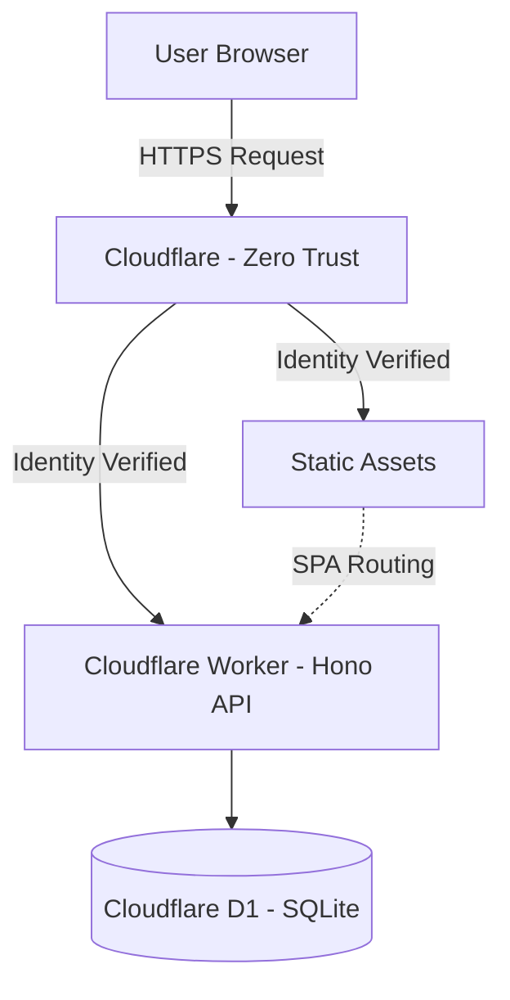

# TaskFlow: Building a Task Manager App on Cloudflare (With Terraform)

I shipped a full-stack task management app to Cloudflare's edge network, secured it with Zero Trust authentication, managed the entire infrastructure as code with Terraform, and discovered that "deleted" resources aren't always actually deleted.

This is TaskFlow: my personal Trello/Asana/Monday hybrid built to learn Cloudflare's platform while solving a real problem — I needed a task system that was simple and matched how my brain works (currently at least).

The result is a production-ready app running on **Cloudflare Workers**, backed by **[Cloudflare D1](https://developers.cloudflare.com/d1/)** ([SQLite at the edge](https://blog.cloudflare.com/introducing-d1/)), protected by **Zero Trust Access** (no app-level auth required), with **reproducible infrastructure** via Terraform. Also includes: kanban boards, drag-and-drop everything, auto-archiving, analytics, dark mode, and just enough polish that I actually use it daily.

Full transparency: I love building stuff. And I *especially* love building stuff that teaches me cloud platforms I haven't fully worked with yet. I've shipped projects on GCP (Cloud Run) and [AWS](https://daltonousley.com/blog/react-form-aws-backend) (serverless bits), so Cloudflare felt like the perfect "new terrain" to kick off 2026. If I'm going to learn something, the learning should *matter*.

> Try TaskFlow (sanitized demo): [Live Demo](https://daltonbuilds.github.io/task-flow-public/)
> 
> 
> **Clone it:** [GitHub Repo](https://github.com/DaltonBuilds/task-flow-public)
> 

## Why TaskFlow exists

I love project management apps. I also love *not* spending half my day "organizing work" instead of doing the work (okay, that's a lie — I do love organizing and sometimes use it to procrastinate, but I digress).

For 2026, I wanted a task system I'd actually stick with. Something lightweight, opinionated, with just enough structure to keep me honest. That meant:

- **Quick capture** (creating a task should feel like jotting a note, not filing taxes)
- **A board that feels like progress** (kanban flow, clear stages, visual momentum)
- **Analytics that call me out** when I'm confusing "busy" with "productive"
- **Personal customization** (themes, backgrounds, the stuff that makes me want to keep using it)

Most importantly: I wanted it **secure by default** without building a full authentication system. No login pages. No password resets. No session management. Just edge-level protection and a locked door at the perimeter (at least for now).

## What is TaskFlow?

**TaskFlow** is a lightweight kanban-based task manager built around a simple pipeline:

**Backlog → To Do → In Progress → Review → Done**

<Image 
  src="/blog/images/task-flow-simple-pipeline-kanban-style.avif" 
  alt="Kanban style pipeline with simple stages" 
/>

This flow keeps me honest:

- **Backlog** = "not now"
- **To Do** = "committed"
- **In Progress** = "actively working on this"
- **Review** = "final pass before shipping"
- **Done** = "celebrate for 0.7 seconds and move on"

I have since created the ability to customize this pipeline with other templates (or blank board) but I generally find myself sticking to the pipeline above.

### Core features

**Multi-project support**

Each project gets its own board, columns, tasks, and workflow rules (like auto-archive behavior).

**Drag-and-drop everything**

Tasks move between columns. Columns can be reordered. The board evolves as the work evolves.

**Smart archiving**

Manual archive when you're ready, or set auto-archive per column. Example: Configure the "Done" column to auto-archive after 7 days, so completed work doesn't clog up the column for long.

**Due dates and reminders**

A board is great for flow. Dates are great for reality. TaskFlow includes due dates, auto-reminders for upcoming deadlines, and support for recurring tasks.

**Project templates**

Start with the classic kanban stages, a blank board, or other templates that match different workflows (content pipelines, launches, study plans).

**Analytics dashboard**

Quick snapshot of active tasks, completed work, overdue items, what's due today, breakdowns by status/priority, and velocity trends over time. It answers one question fast: "Am I finishing things, or just moving them around?"

**Quality of life layer**

App-wide search, activity feed, keyboard shortcuts, light/dark/system themes, background customization, and an offline support (because reality for me includes Wi-Fi betrayal or ‘work-on-the-mountain’ days).

The goal wasn't to build "Trello, but smaller." The goal was to build something that stays clean while real life happens — tasks pile up, priorities shift, and "Done" becomes a graveyard if you don't manage it.

## Design principles (rules I set before writing code)

Every project needs constraints. Without them, "simple app" becomes "I wonder if I should keep feeding this thing?"

<Image 
  src="/blog/images/task-flow-calendar-view-user-menu.avif" 
  alt="Kanban style pipeline with simple stages" 
/>

### What TaskFlow must do

**Stay frictionless**

The UI should be fast, obvious, and satisfying. If it's not satisfying, I'll abandon it for a notebook (and then abandon the notebook too — don’t judge).

**Match how I naturally work**

The pipeline keeps me honest. Backlog is "not now." To Do is "committed." In Progress means "I'm dedicating actual time to this."

**Make progress visible**

Momentum should feel real, and analytics should surface the truth about whether I'm shipping or just rearranging.

**Include personal customization (but not feature bloat)**

Theme support and backgrounds aren't strictly necessary, but they increase sustained usage. And for a personal productivity tool, sustained usage is the entire game. I’m a dark-theme guy, what can I say? I don’t like burning off my retinas with bright white backgrounds.

**Security without building auth**

Protect the app at the edge with Cloudflare Zero Trust Access. If you're not allowed, you don't even reach the Worker.

### What TaskFlow refuses to do

**No multi-tenant SaaS platform**

TaskFlow is not trying to be the next Trello. It's trying to be *my* tool.

**No complicated permissions model**

No roles. No workspaces. No "Admin / Editor / Viewer" hierarchies. Just: "Is it me? Great. Proceed."

**No over-engineered backend**

The goal was clean, simple architecture: fast runtime, sane persistence, reproducible infrastructure. Not a distributed systems masterpiece.

**No productivity tool that becomes a chore**

If using the tool feels like work, the tool has failed.

## Architecture: how TaskFlow actually works

The UI is the fun part. But the *real* reason TaskFlow was worth building is the architecture behind it.

I wanted this to be more than "a nice React app with a database." The goal was a real deployed system: secured at the edge, reproducible infrastructure, clean deployment flow, minimal moving parts, and enough real-world sharp edges to learn from. The greatest motivation is by far the learning opportunity. 

### The stack

- **Cloudflare Workers** for the runtime (edge execution)
- **Hono** for routing and API ergonomics
- **Cloudflare D1** for persistence (SQLite-based, edge-optimized)
- **Vite** for frontend build tooling
- **Wrangler** for local dev and deployment
- **[Terraform](https://registry.terraform.io/providers/cloudflare/cloudflare/latest/docs)** for infrastructure as code (IaC)
- **Cloudflare Zero Trust Access** for authentication at the edge

In practice: TaskFlow is a Worker-backed web app that serves static frontend assets at the edge, routes API calls through the Worker, and persists state in D1 — while Cloudflare Access sits in front and acts as the bouncer.

### The architecture at a glance



Here's the mental model:

1. Your browser requests the app
2. **Cloudflare Access** checks whether you're allowed
3. If allowed, Cloudflare serves:
    - **Static assets** (HTML/CSS/JS) directly from the edge
    - **API requests** go to the Worker
4. The Worker reads/writes to **D1** for persistence

### Edge-first security (the decision that shaped everything)

TaskFlow is a personal tool. I didn't need user registration, OAuth flows, or a full identity layer. But I *did* need it locked down.

So instead of building auth *inside* the app, I put auth *in front* of the app:

- Cloudflare Access protects the app at the edge
- Policies allow only specific identities (email rules)
- If you're not allowed, the Worker never runs

**Result:**

- No app-level auth code
- No session management or user tables
- Fewer attack surfaces
- Simpler application logic overall

It's basically: "You don't get to talk to my app unless the edge says you're cool."

**Why this matters for production systems:**

Edge authentication decouples security from application logic. You get strong access control without polluting your codebase with auth flows. For single-user or small-team tools, this is a massive complexity reduction.

### Static asset delivery the right way

Early on, I hit the classic Workers problem: API routes worked, but CSS/JS didn't load. The app rendered… *partially*.

There are hacky ways to solve this (embedding assets, inlining everything), but the current correct approach I learned is:

**[Workers Static Assets](https://developers.cloudflare.com/workers/static-assets/)** via `wrangler.jsonc`:

```json
{
  "name": "taskflow",
  "main": "./dist/_worker.js",
  "compatibility_date": "2025-12-30",
  
  "assets": {
    "directory": "./dist"
  }
}

```

And `.assetsignore` to exclude Worker internals:

```
_worker.js
*.map

```

This preserves a clean split:

- Static delivery = CDN edge
- Dynamic logic = Worker
- Persistence = D1

**Why this matters:**

On edge platforms, static asset delivery isn't automatic. Treating it as a first-class concern gives you performance and simplicity. Cloudflare serves assets before invoking your Worker, which means faster loads and lower compute costs.

### Data layer: D1

D1 is Cloudflare's SQLite-based database. For TaskFlow, it's exactly the right tool:

- Relational model fits the domain well (projects, columns, tasks, comments, activity logs)
- Lightweight and fast
- Close to the runtime (low latency)
- Minimal operational overhead

The schema includes:

```sql
-- Boards table
CREATE TABLE IF NOT EXISTS boards (
  id TEXT PRIMARY KEY,
  name TEXT NOT NULL,
  description TEXT,
  created_at TEXT NOT NULL,
  updated_at TEXT NOT NULL,
  archived_at TEXT,
  deleted_at TEXT
);

-- Columns table
CREATE TABLE IF NOT EXISTS columns (
  id TEXT PRIMARY KEY,
  board_id TEXT NOT NULL,
  name TEXT NOT NULL,
  position INTEGER NOT NULL DEFAULT 0,
  created_at TEXT NOT NULL,
  updated_at TEXT NOT NULL,
  archived_at TEXT,
  deleted_at TEXT,
  FOREIGN KEY (board_id) REFERENCES boards(id) ON DELETE CASCADE
);

-- Tasks table
CREATE TABLE IF NOT EXISTS tasks (
  id TEXT PRIMARY KEY,
  board_id TEXT NOT NULL,
  column_id TEXT NOT NULL,
  title TEXT NOT NULL,
  description TEXT,
  priority TEXT NOT NULL DEFAULT 'medium',
  due_date TEXT,
  tags TEXT NOT NULL DEFAULT '[]',
  position INTEGER NOT NULL DEFAULT 0,
  created_at TEXT NOT NULL,
  updated_at TEXT NOT NULL,
  archived_at TEXT,
  deleted_at TEXT,
  FOREIGN KEY (board_id) REFERENCES boards(id) ON DELETE CASCADE,
  FOREIGN KEY (column_id) REFERENCES columns(id) ON DELETE CASCADE
);

```

Since TaskFlow is intentionally single-user, D1 keeps the architecture lean without sacrificing correctness.

**Why SQLite at the edge works:**

For read-heavy workloads with occasional writes (like a task manager), D1's consistency model is perfect. You get ACID transactions, relational queries, and global distribution without managing a traditional database cluster.

### Infrastructure as code with Terraform

Everything that matters is reproducible:

**D1 database provisioning:**

```hcl
resource "cloudflare_d1_database" "taskflow_db" {
  account_id = var.cloudflare_account_id
  name       = var.database_name
}

```

**Zero Trust Access application:**

```hcl
resource "cloudflare_zero_trust_access_application" "taskflow_app" {
  account_id                = var.cloudflare_account_id
  name                      = "TaskFlow"
  domain                    = "taskflow.YOURDOMAIN.com"
  type                      = "self_hosted"
  session_duration          = "24h"
  auto_redirect_to_identity = true
}

```

**Access policy (email-based):**

```hcl
resource "cloudflare_zero_trust_access_policy" "taskflow_owner" {
  account_id = var.cloudflare_account_id
  name       = "Allow TaskFlow Owner"
  decision   = "allow"

  include = [
    for e in var.access_allowed_emails : {
      email = { email = e }
    }
  ]
}

```

This means I can rebuild the environment without clicking through dashboards or remembering what I configured 7 months ago.

**Why IaC matters for learning:**

Terraform forces you to understand resources at the API level. You learn what actually matters (account IDs, token scopes, resource dependencies) versus what the UI hides from you.

### Operational mindset (what this architecture optimizes for)

TaskFlow's architecture is shaped around:

- **Secure-by-default access** (edge auth, no app-level sessions)
- **Minimal auth complexity** (no login screens, password flows, or user management)
- **Fast edge delivery** (static assets served globally, close to users)
- **Clean separations** (static vs dynamic vs data layers)
- **Reproducible infrastructure** (Terraform for everything)
- **Future CI/CD readiness** (planned next: automated deployments via GitLab)

The goal was something I can iterate on safely, deploy repeatedly, and keep stable while adding features and continuing to learn.

## The build story: 5 problems I actually hit

Every project has a happy path architecture diagram. And then every project has reality.

TaskFlow had calm moments. But it also had the classic cloud engineering experience: everything is correct, nothing works, and you start bargaining with the universe.

Here are five problems I hit, plus what actually fixed them.

### 1. Auth without app auth (I refuse to build login screens for myself)

**Symptom**

I wanted TaskFlow protected, but I didn't want to build traditional authentication. No sign-in screens, no sessions, no user tables.

**Root cause**

Most apps assume authentication lives *inside* the application. That's fine, but it drags you into auth flows, edge cases, and maintenance that I didn't need for a single-user tool.

**Fix**

I put **[Cloudflare Zero Trust Access](https://developers.cloudflare.com/cloudflare-one/access-controls/policies/)** in front of the app:

- Access policy at the edge allows only specific identities (email-based rules)
- The Worker and static assets are only reachable if Access allows it
- No authentication code in the application itself

**Takeaway**

If your use case is "this app is for me (and maybe one or two trusted people)," edge auth is a cheat code. You get strong security without spending days on auth infrastructure.

### 2. Terraform + Cloudflare provider quirks (why is `account_id` everywhere?)

**Symptom**

Terraform apply failures that felt like a rotating cast of:

- Missing variables
- Auth errors
- "This resource needs `account_id` but the provider already knows it" (except it doesn't)
- CI runs prompting for values that were definitely set somewhere

**Root cause**

Cloudflare's Terraform provider has quirks around where `account_id` belongs (often resource-level, not provider-level) and properly scoped API tokens.

**Fix**

I standardized the setup:

- Used `CLOUDFLARE_API_TOKEN` consistently (Terraform + Wrangler)
- Stored secrets as protected CI variables (GitLab)
- Passed non-sensitive values via `TF_VAR_*` environment variables
- Ensured the token had explicit permissions for D1, Zero Trust/Access, and Workers

Example token scopes needed:

- **Account** → **D1** → Edit
- **Account** → **Access: Apps and Policies** → Edit
- **Account** → **Workers Scripts** → Edit

**Takeaway**

Terraform problems are rarely "Terraform is broken." They're usually "my inputs and provider expectations aren't aligned." Treat tokens, scopes, and variable flow like first-class infrastructure concerns.

### 3. The ghost Zero Trust application (yes, actually haunted)

**Symptom**

Terraform refused to create a Zero Trust Access application because it claimed the resource already existed, even though I deleted it in the Cloudflare UI.

**Root cause**

The UI deletion didn't fully remove the underlying Access application at the API level. So Terraform was right: the resource was still there, just invisible in the dashboard.

**Fix (after a good night’s sleep)**

Some research with Gemini did the trick:

1. Exported `CLOUDFLARE_API_TOKEN` and `account_id` into my shell
2. Used `curl` against Cloudflare's API to list Access applications:

```bash
curl -X GET \
  "https://api.cloudflare.com/client/v4/accounts/${ACCOUNT_ID}/access/apps" \
  -H "Authorization: Bearer ${CLOUDFLARE_API_TOKEN}"

```

1. Found the orphaned application and its ID in the JSON response
2. Issued an explicit DELETE request (APP_ID came from the previous request):

```bash
curl -X DELETE \
  "https://api.cloudflare.com/client/v4/accounts/${ACCOUNT_ID}/access/apps/${APP_ID}" \
  -H "Authorization: Bearer ${CLOUDFLARE_API_TOKEN}"

```

After that, the very next `terraform apply` succeeded. Like it had been waiting for the spirit to be released.

**Takeaway**

When cloud dashboards lie (or simplify too aggressively), go straight to the API. If Terraform says a resource exists, believe Terraform and then prove it with an API query. The API is the source of truth.

### 4. Static assets weren't being served (why am I looking at only a non-working header component!?)

**Symptom**

The Worker routes worked, but the UI was way of. CSS and JS weren't loading.

**Root cause**

Workers can serve dynamic routes easily, but static asset delivery requires explicit setup. If you don't wire static assets properly, the Worker runs fine while your browser fails to load the frontend bundle.

**Fix**

I implemented the modern Cloudflare approach:

1. Configured Workers Static Assets in `wrangler.jsonc`:

```json
{
  "assets": {
    "directory": "./dist"
  }
}

```

1. Added `.assetsignore` so internal Worker files don't get publicly served:

```
_worker.js
*.map

```

1. Built the frontend with Vite (`npm run build`)
2. Deployed with `wrangler deploy`

After that:

- Assets were served at the edge
- The Worker handled API routes cleanly
- The app finally looked like an app again

**Takeaway**

On edge platforms, static delivery is not an afterthought. Wire assets correctly and you get performance + simplicity. Cloudflare serves assets before invoking your Worker, which means faster loads and lower compute costs.

Fun Fact: don’t rely on AI 100% — ‘Auto’ mode with Cursor recommended inlining the CSS and JS but that would’ve likely been a performance issue even if it was small enough in size to work. A quick sanity check with a better LLM model (updated and with research abilities) outside of Cursor unearthed the modern approach that I went with.

### 5. D1 read replication: Terraform sent "null," Cloudflare said "absolutely not"

**Symptom**

Terraform would try to configure D1 read replication as `null`, and Cloudflare's API rejected it.

**Root cause**

The Cloudflare API expected a concrete configuration, but Terraform was effectively sending "nothing," which isn't always the same thing as "disabled."

**Fix**

I made the configuration explicit:

```hcl
resource "cloudflare_d1_database" "taskflow_db" {
  account_id = var.cloudflare_account_id
  name       = var.database_name

  # Explicitly disable read replication
  read_replication {
    mode = "disabled"
  }
}

```

**Takeaway**

Cloud APIs often prefer explicit intent. "Null" can mean "unset," "unknown," or "you didn't mean that." When in doubt, be painfully clear about what you want.

## Current state and what's next

After the CSS returned from the void and the ghost was exorcised, TaskFlow landed in a really good place:

**Current state:**

- Deployed on Cloudflare Workers (edge runtime)
- Protected by Cloudflare Zero Trust Access
- Backed by Cloudflare D1 for persistence
- Static assets served properly at the edge (Vite build output via Workers Assets)
- Infrastructure defined via Terraform (reproducible environment)
- Feature-complete enough to be genuinely useful (multiple projects, templates, drag-and-drop for tasks + columns, archiving/auto-archiving, reminders, search, analytics, shortcuts)

In other words, this is a tool I can actually lean on daily. I migrated everything over from Notion, Trello, Notes App, and Asana into one app I can literally call my own.

**Next focus: CI/CD**

The biggest next step is automated deployments. Right now, the system is reproducible and deployable, but the next evolution is making it *repeatable*:

- Terraform `plan`/`apply` stages in GitLab CI
- Wrangler-based deploy stages
- Environment separation (dev → staging → prod)
- Safe variable and secret handling
- "Push code, get deployment" without manual steps

**Future iterations (the fun part)**

TaskFlow is also a perfect candidate for gradual AI-assisted upgrades:

- **AI-proposed workflows** (suggest templates or stages based on project type)
- **Forecasting + trend awareness** (what's slipping, what's accelerating, where bottlenecks form)
- **Work optimization** (WIP limit suggestions, cycle-time insights, overload detection)
- **Natural language task entry** ("remind me every Thursday" / "turn this into subtasks")
- **General assistance** (summaries, planning, gentle nudges, "what should I focus on next?")

The app stays simple, but it can become smarter over time.

## Try it yourself

I'm publishing a basic sanitized version of TaskFlow so you can explore the architecture and run your own instance.

> View TaskFlow: [Live Demo](https://daltonbuilds.github.io/task-flow-public/)
> 
> 
> **Clone it:** [GitHub Repo](https://github.com/DaltonBuilds/task-flow-public)
> 

**What "sanitized" means:**

The public version keeps the core architecture and functionality, but strips anything personal/private:

- No personal project names or real task data
- Safe defaults and example seed data
- No hardcoded IDs or environment-specific secrets
- Infrastructure and deployment patterns preserved

**Quickstart (once the repo is public):**

1. Clone the repo
2. Configure environment variables (Cloudflare account + API token)
3. Provision infrastructure with Terraform (D1 + Access config)
4. Run locally 
5. Deploy (Wrangler deploy)

The README will include full setup instructions.

## Evolution: from proof of concept to production

<Image 
  src="/blog/images/taskflow-new-ui-nextjs-migration.avif" 
  alt="New look for TaskFlow, Kanban style pipeline with fresh look" 
/>

The version described throughout this article represents TaskFlow's initial architecture—the learning phase where I focused on mastering Cloudflare's platform, Terraform workflows, and infrastructure as code patterns.

**That original implementation worked.** It proved the concept, taught me edge computing, and became my daily task manager. But it was also a 10,000+ line vanilla JavaScript file with inline styles, mixed concerns, and performance limitations. Perfect for rapid prototyping and infrastructure learning. Not ideal for long-term maintenance or feature velocity.

So I iterated.

### The Next.js migration

Once the cloud infrastructure was solid and the Terraform patterns were proven, I shifted focus to frontend architecture. The current production version of TaskFlow runs on **Next.js 16** with a full-stack architecture:

**Frontend improvements:**

- Component-based architecture with 50+ reusable UI components
- TypeScript throughout (type safety catches bugs before they reach production)
- [shadcn/ui](https://ui.shadcn.com/) for standardized, accessible components
- React Query for intelligent data caching and background updates
- Tailwind CSS for maintainable, optimized styling
- Code splitting for faster initial loads (60-80% improvement)

**Backend modernization:**

- Proper separation of concerns (`/components`, `/hooks`, `/server/routes`, `/services`)
- Zod validation for API requests/responses
- Structured database migrations
- Comprehensive error boundaries and offline handling

**Developer experience:**

- ESLint + Prettier for consistent code quality
- Full type checking prevents runtime errors
- New features ship 5-10x faster with organized codebase
- Testing infrastructure ready for expansion

**The result:** A maintainable, type-safe application that scales to hundreds of concurrent users with global edge performance.

### Why this matters (beyond the code)

This evolution represents how real engineering work happens. You don't build perfect systems from day one. You:

1. **Learn the platform** (Cloudflare, Terraform, edge architecture)
2. **Prove the concept** (fast iteration, infrastructure focus)
3. **Identify bottlenecks** (performance, maintainability, type safety)
4. **Iterate strategically** (Next.js migration, TypeScript, modern tooling)
5. **Ship improvements** (better UX, faster features, production stability)

The sanitized public repo reflects the original architecture—the infrastructure learning phase. My production instance runs the evolved version. Both taught me different skills. Both matter.

Start with working solutions, measure what matters, iterate based on real constraints, and always optimize for the next person (including future me) who has to maintain the code.

---

TaskFlow taught me more about cloud infrastructure, modern web architecture, and iterative development than any tutorial could. If you're learning these platforms or building personal tools that evolve with you, I hope this walkthrough helps.
Thanks for reading!