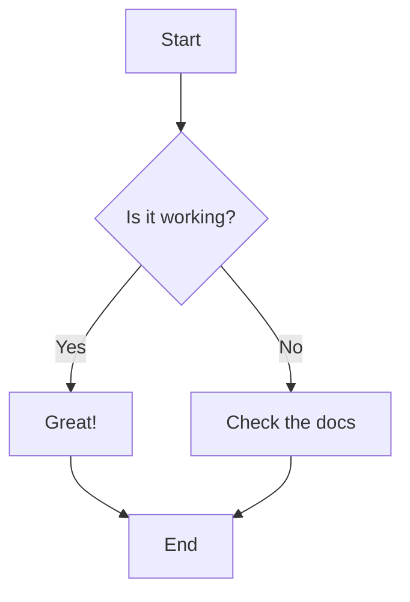
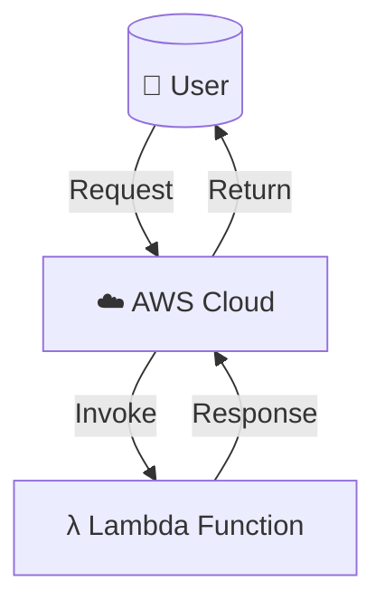
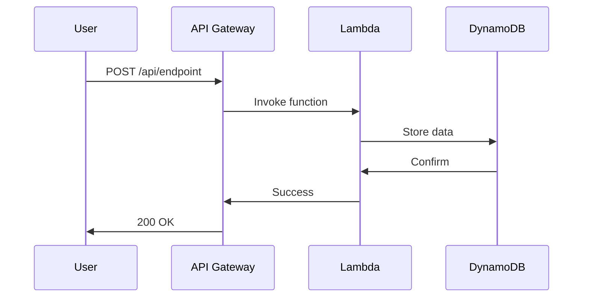

# Mermaid Diagram Support in MDX

## Overview

Your blog now supports **Mermaid diagrams** natively in MDX files! The implementation is theme-aware and will automatically switch between light and dark modes based on your site's theme.

## Usage

To add a Mermaid diagram to your blog post, simply use a code block with the `mermaid` language identifier:

````markdown

````

## Supported Diagram Types

Mermaid supports many diagram types, including:

1. **Flowcharts**
2. **Sequence Diagrams**
3. **Class Diagrams**
4. **State Diagrams**
5. **Entity Relationship Diagrams**
6. **User Journey Diagrams**
7. **Gantt Charts**
8. **Pie Charts**
9. **Git Graphs**

## Examples

### Flowchart

````markdown

````

### Sequence Diagram

````markdown

````

## Theme Support

The Mermaid component automatically adapts to your site's theme:

- **Light Mode**: Uses the default Mermaid theme with light colors
- **Dark Mode**: Uses the dark Mermaid theme with appropriate colors

The theme variables are configured to match your site's design system for a seamless experience.

## Error Handling

If a Mermaid diagram fails to render (e.g., due to syntax errors), an error message will be displayed instead of breaking the page. Check the browser console for detailed error information.

## Technical Implementation

The implementation includes:

1. **Mermaid.tsx** - A client-side React component that:
   - Detects the current theme (light/dark)
   - Initializes Mermaid with theme-specific configuration
   - Renders diagrams with proper error handling
   - Re-renders when the theme changes

2. **MDXContent.tsx** - Updated to detect `mermaid` code blocks and render them using the Mermaid component instead of the regular CodeBlock component

## Resources

- [Mermaid Documentation](https://mermaid.js.org/)
- [Mermaid Live Editor](https://mermaid.live/) - Test your diagrams before adding them to your blog

## Notes

- Mermaid diagrams are rendered client-side, so they won't appear in the initial HTML
- The diagrams are responsive and will adjust to different screen sizes
- All diagrams are styled to match your site's theme automatically

